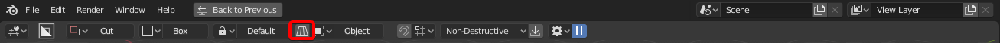
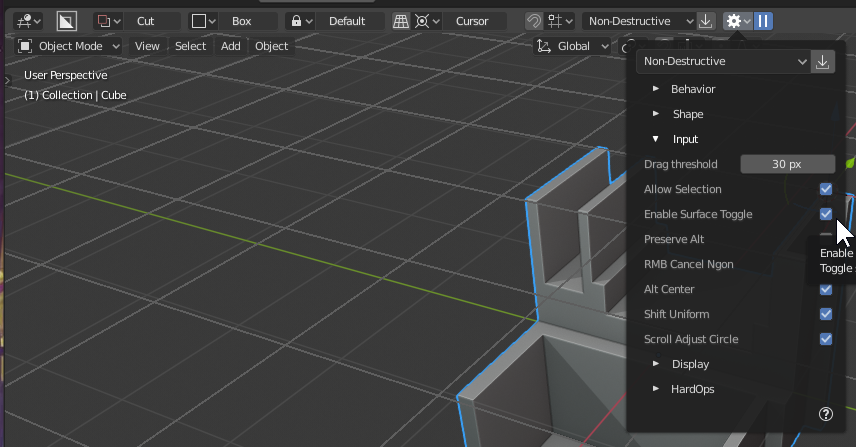
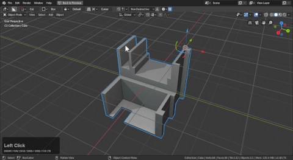

## Alignment

# Alignment Options

Alignment options can be found in the following areas:

Topbar

D-Pie

N-Panel

# View Aligned Drawing

[View aligned is a throwback to the retro boxcutter of yore.](https://masterxeon1001.com/2016/04/26/box-cutter-guide-v1/)

When unchecked the drawing will always be aligned to view which works great in orthographic.

> View align will also make the snap dots view align which can be a gotcha if you aren't aware so keep that in mind.

This can come in handy when working conceptually.

You can also use view align to work from the side and then rotate the view and align however the plane for creation might be uniquely offset. But working with the view align is essential enough that it remains in the topbar for quick use.

# Alternative Draw Surfaces

When it comes to using boxcutter drawing on the surface uses something called surface to orient your cutter sometimes when using solidify or modelling tricky objects the normals and thus the orientation can get hard to deal with.

Boxcutter has a series of options intended to make working with unusual surfaces easier.

# World

To show orientation differences we'll show how surface differs from world.

> The above gif should show world in action and how it can make drawing on surfaces difficult but it does have a use.

# Surface

Surface is the default and is recommended for 90% of use cases involving meshes. Surface requires the draw begin *with the mouse over the mesh*. Drawing outside of the mesh triggers world since there is no nearest surface as the fallback. In my personal use of the tool I switch between surface and cursor grid (no gizmo) for working on complex surfaces.

> If your drawing isn't working with the selection. Make sure the surface orientation is set.

# Cursor

> Cursor is a work in progress. That said is is usable to an extent less than what I'd personally like.

To show cursor in action:

A few things to note:

- with the default configuration of LMB select / shift + RMB places the Cursor
- cursor "Z" axis uses the rotation of the cursor the way intended
- the alt + W hotkey has a toggle in the behavior >> input >> Enable Surface Toggle checkbox

An option for removing the gizmo is also present in the event you just need the cursor grid.

> Which makes this much easier to work with personally.

When this state is active you can use cursor for orientation with drawing.

> And press alt + W to exit and toggle state if the grid isn't showing initially.

Unfortunately snapping dots do not work with cursor grid at this time.

> We intend to expand on this idea multi-fold in future versions.
