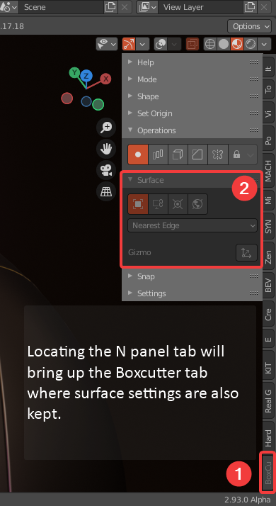

## Alignment

# Alignment Options

Alignment options can be found in the following areas:

Topbar

D-Pie

N-Panel

# Gridfinite Grid

<a href="https://twitter.com/proxeIO">Proxe</a> has once again outdone himself on the 715 release. The released version of grid is the 3rd iteration with the first 2 not being adequate enough for release. AR also remains integral and made the initial prototype.

This grid is infinite. Users can press ctrl during boxcutter to grab a face vector and go to work. There is even a fade and color change system to make it visually pleasing.

The previous system utilizing dots would only go so far.

Also the previous dot system wasn't made for snapping. Just initial orientation.

Thanks to this drawing with precision is faster and more capable than ever.

And without limits.

The new grid system will be taking over all alignment systems in the future going forward as it is further refined. Our initial release isn't perfect but serves as a demo of what we are aiming to go for. As with as systems as it gets perfected it will be right at home and an integral part of the boxcutter workflow.

 Try grabbing a face vector and doing an offset cut![/caption]

# Surface Align

Surface align is a work in progress. When object is active the grid will attempt to orient to the surface for snapping via the grid. In the event of directional inaccuracy simply drawing without grid is more optimal.

# View Align

View align uses the classic systems from previous releases. Grid has not been integrated yet but will in the future. View align works in perspective and orthographic.

<h2>Cursor</h2>

I am excited to say cursor has been improved dramatically. In this update the cursor can be used for grid positioning and orientation however I hope to create support tools for assisting with getting the perfect cursor alignment.

When it comes to using grid with cursor. Aligning the 3d cursor to an edge can be useful.

Then use cursor as alignment. This can come in handy for hard to reach areas.

<h2>World</h2>

Last but not least the fallback of fallbacks received the same updates. Now with grid the world is better positioned for level design and make box work.

# Grid Performance

Having a grid that is infinite means that a larger grid size is not needed due to the grid generating as you move. However adding more units than 10 can result in some heavy performance and is not recommended for slower PCs.

<em>Even I don't go past 10.</em>

Some of the lower configs look quite interesting.

2 gives us an idea for a future tool. And 0 is no grid at all and can be interesting to use as well. We may add a preset panel in a future release.

# Grid Color

Grid is typically grey but in the examples I have grid color checked which makes the grid the same color as the cutter in use. This should be more useful for helping visually know what is about to happen.

This can be turned off under display in the behavior panel.

