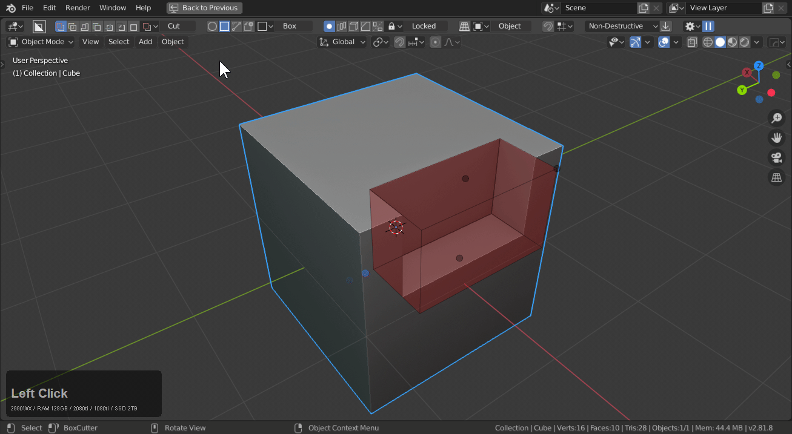
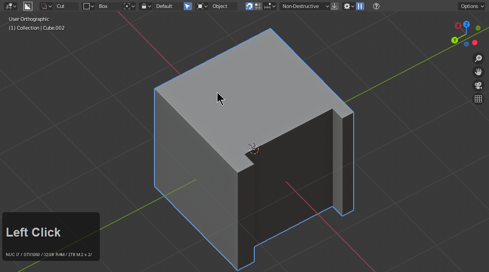
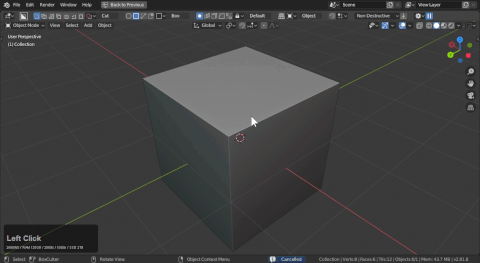
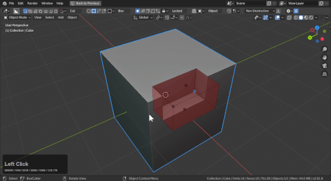
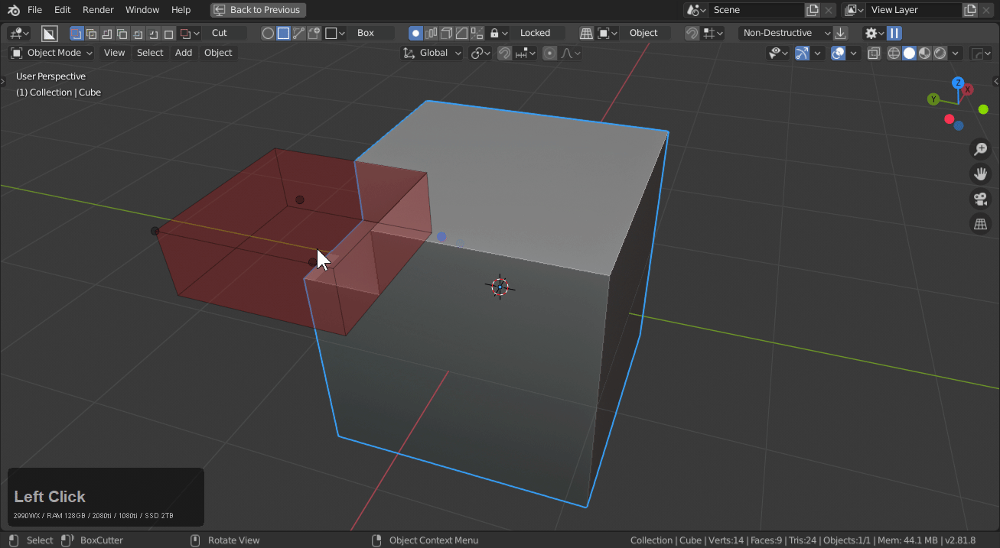
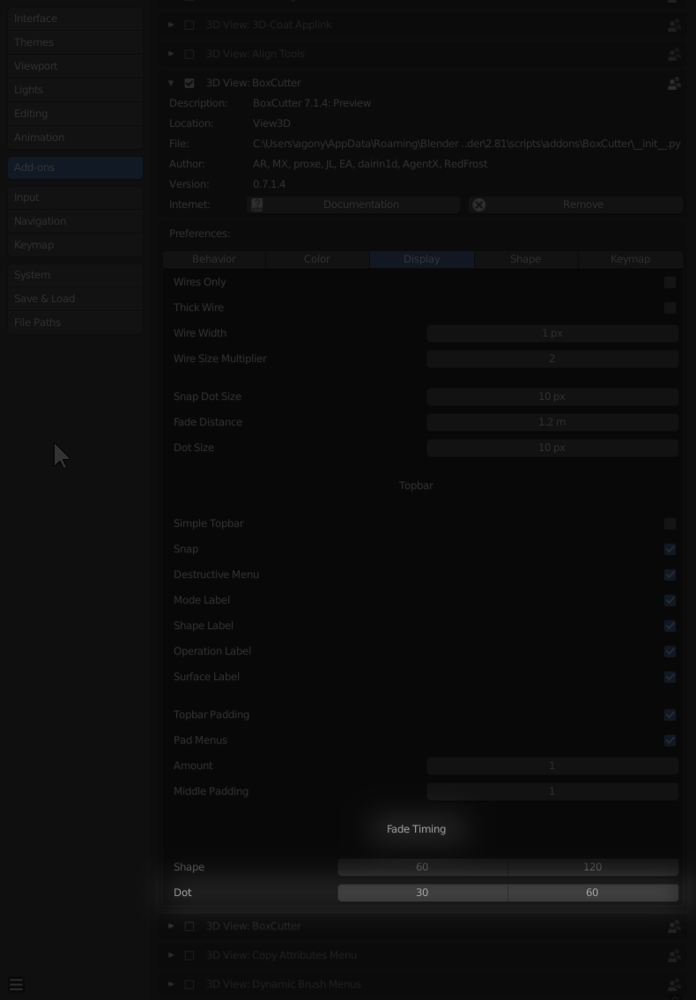
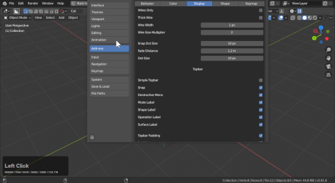

## Re-Introducing Dots

# Shape Edit Mode

While drawing a shape. **press tab** to enter edit mode and pause the shape.

Alternatively release lock allows for the shape to automatically pause. With lazorcut lock, lazorcut can also automatically be stepped into a live state.

Box possesses dots for the following:

- extrude(depth)
- offset (surface) **shift dragging will translate on a 2d plane**
- draw
- bevel (bevel)

To show modifying these dots in action:

To apply just click the shape or press spacebar.

# Dot Toggle

Alt + D will toggle dots off and on. Dots off still allows for hotkeys and can result in a quieter experience.

# Dot Draw Manipulation

On the corner of a shape is the draw dot. Move this to adjust the shape.

While pressing alt users can uniform adjust the shape.

And shift for constrain square.

# Using Dots to perfect radial array.

>> Pressing V triggers array V a 2nd time triggers radial array (during draw)

In the pause state of radial array users can use the draw dot with alt and shift to constrain to uniform and create shapes better suited for radial array.

# Dots w/ Circle

Custom / Circle also has dots similar to box.

>> Bevel dot is present but contour wont show in circle.

And custom shape.

>> Notice custom doesnt have the bevel 0dot.

# Ngon Dots

To be written. They will be there though.

# Dot prefs

Using fade in prefs users can choose how quick or slow dots appear.

>> Numbers are in milliseconds. So 1200 = 1.2 seconds

To show that in action.

# About Dots

Dots was a subsystem for boxcutter 690 and was added in the final 2.79 release.

<iframe width="560" height="315" src="https://www.youtube.com/embed/9wqdXqtYQns" frameborder="0" allowfullscreen></iframe>

For 2.8 we attempted to optimize the hotkey portion of the workflow but without dots Boxcutter can seem daunting.
