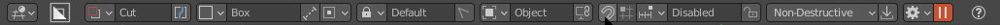

## Dots

# Snap Dots

Snap dots are a system of preliminary snapping in boxcutter able to be activated with Ctrl (after enabling). The goal is the assit with initial shape positioning.

>> Dots show up on Ctrl press but only if Boxcutter is active and Dots are enabled.

>> Topbar label will display if dots are active or not.

The video below goes over the snap area of Boxcutter and how it is currently. 

[boxcutter 718_7 - Topbar Snap Area Adjustments]

<iframe width="560" height="315" src="https://www.youtube.com/embed/XpJ7gOcYfw0" title="YouTube video player" frameborder="0" allow="accelerometer; autoplay; clipboard-write; encrypted-media; gyroscope; picture-in-picture" allowfullscreen></iframe>

[boxcutter 718_9: MiniHelper - Snap Slider]

<iframe width="560" height="315" src="https://www.youtube.com/embed/4jylOZ7D21A" title="YouTube video player" frameborder="0" allow="accelerometer; autoplay; clipboard-write; encrypted-media; gyroscope; picture-in-picture" allowfullscreen></iframe>

## Dynamic Dots (default)

The default dot system of Boxcutter is dynamic dots. Dynamic dots also offer benefits to general users and aims to be more nimble and dynamic with usage. 

[boxcutter 718_7 - Snap Dot Adjustments]

<iframe width="560" height="315" src="https://www.youtube.com/embed/Q7q4PoiWh7U" title="YouTube video player" frameborder="0" allow="accelerometer; autoplay; clipboard-write; encrypted-media; gyroscope; picture-in-picture" allowfullscreen></iframe>

Some of the benefits of dynamic dots are:

- view dots 
- world dots
- fade

> Fade is an extra but essential to a smooth experience in ideal conditions. 

And the behavioral overrides of:

- auto center draw from face
- auto center draw from edge

> These apply mainly to box / custom. Ngon doesn't need snap dots.

We also strive to make it performant w/ subdivision. 

<iframe width="560" height="315" src="https://www.youtube.com/embed/8UgKHdjyDys" title="YouTube video player" frameborder="0" allow="accelerometer; autoplay; clipboard-write; encrypted-media; gyroscope; picture-in-picture" allowfullscreen></iframe>

When it comes to dots there is much more to them. But first and foremost their goal is preliminary object placement.

<iframe width="560" height="315" src="https://www.youtube.com/embed/DB9MbeXs_0g" title="YouTube video player" frameborder="0" allow="accelerometer; autoplay; clipboard-write; encrypted-media; gyroscope; picture-in-picture" allowfullscreen></iframe>

# Static Dots (optional)

Static dots remain "one behavior back" with our contemporary system and what it lacks in dynamics, it makes up for in extras. Alternative to Dynamic Dots is the Static Dot system.

[boxcutter 718_7 - Static Snap Dots]

<iframe width="560" height="315" src="https://www.youtube.com/embed/CA3A7VU-ELg" title="YouTube video player" frameborder="0" allow="accelerometer; autoplay; clipboard-write; encrypted-media; gyroscope; picture-in-picture" allowfullscreen></iframe>

[boxcutter 718_8 - More About Static]

<iframe width="560" height="315" src="https://www.youtube.com/embed/Dx03pmwMBP4" title="YouTube video player" frameborder="0" allow="accelerometer; autoplay; clipboard-write; encrypted-media; gyroscope; picture-in-picture" allowfullscreen></iframe>

Some of the extras exclusive to static dots are:

- Dot to dot snap
- Alignment preview
- Dot subdivision
- Subdivision preview

> Subdivision preview refers to dot subdivision and is a modification of that feature for display.

Behaviorally the benefits of static are:

- contemporary behavior (what you see is what you get)
- more stable than dynamic and exists as a fallback for issues with dynamic
- less dynamic to the point where dots spawn on a face but dont roll with the cursor

> When I refer to stability, I refer to times in the past in which static had to be the fallback due to Blender changes. In the event issues are encountered with dynamic it is recommended to change and vice versa. The goal of two systems was to ensure it always worked. 

## Static Dots - Alignment Preview

[#boxcutter 718_8 - Static Dots : Alignment Preview]

<iframe width="560" height="315" src="https://www.youtube.com/embed/XUqEUme5t8Q" title="YouTube video player" frameborder="0" allow="accelerometer; autoplay; clipboard-write; encrypted-media; gyroscope; picture-in-picture" allowfullscreen></iframe>

## Additional Content On Static Dots

[#boxcutter 718_8 - Static Dots :Alignment / Pause / Repeat]

<iframe width="560" height="315" src="https://www.youtube.com/embed/fA_HUDnfz30" title="YouTube video player" frameborder="0" allow="accelerometer; autoplay; clipboard-write; encrypted-media; gyroscope; picture-in-picture" allowfullscreen></iframe>

# Shape Dots

Alternative to snapping dots and completely irrelated are shape dots. These dots show when a shape is paused and allows for fine edit. 

<iframe width="560" height="315" src="https://www.youtube.com/embed/oC4TLUdnoHw" title="YouTube video player" frameborder="0" allow="accelerometer; autoplay; clipboard-write; encrypted-media; gyroscope; picture-in-picture" allowfullscreen></iframe>

## Shape Dots Alternative Behavior

In addition to shape dots doing their initial purpose they also have shift alternative behavior.

<iframe width="560" height="315" src="https://www.youtube.com/embed/DB9MbeXs_0g" title="YouTube video player" frameborder="0" allow="accelerometer; autoplay; clipboard-write; encrypted-media; gyroscope; picture-in-picture" allowfullscreen></iframe>

Shift Dragging the following dots do the following:

- extrude (taper)
- offset (move)
- bevel (solidify)
- draw (square or 1:1 if custom)

These optional behaviors are aimed to be used in a pinch when needed but are able to also be handed via the helper on the fly if needed. 

