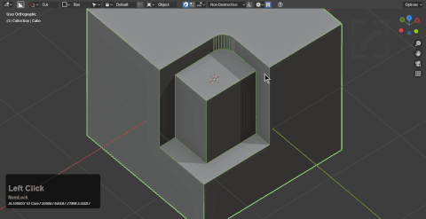

# Edit Mode cutting

> Alt + W in edit mode starts boxcutter

# [Cut](mode_red.md) (in-modal hotkey: X)

Boxcutter supports cut in edit mode.

When shift is held, the cutter will remain live via shift to live and even transition into edit mode. This extends to all the modes listed below.

Clicking apply via topbar will apply the selected cutter and switch back to the target.

# [Knife](mode_blue.md) (in-modal hotkey: K)

Knife box utilizes the intersect algorithm for surface and knife project for view based cutting.

If a mirror modifier is present it will be toggled off during draw to ensure cuts connect properly with the mesh.

# [Inset](mode_purple.md) (in-modal hotkey: X)

Inset can be toggled to with X and adjusted with T while in use.

# [Slice](mode_yellow.md) (in-modal hotkey: X)

Slice can be toggled to via X which will separate while adding the selection to the edit mode instance.

> Shift to live can be used to adjust the cutter after the fact.

# [Extract](mode_black.md) (in-modal hotkey: Y)

Extract can now be used with edit mode. Extractions will be assigned as the custom cutter.

# [Make](mode_grey.md) (in-modal hotkey: A)

Pressing A during draw will transition into a make box.

# Shift To Live

Users are also able to shift to live from edit mode and further edit in object mode.

# Tab edit

Pressing tab during draw even in [edit mode will trigger dots for fine](dots.md) adjustment.

LMB or spacebar to confirm.

# [Snapping](snapping.md)

[Snapping](snapping.md) is also supported in edit mode with face, edges, vert.

