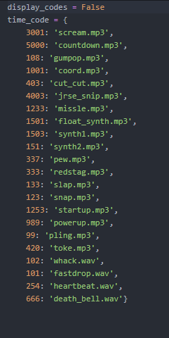

## Fade System

Fade was added to boxcutter as of version 714. It is a visual aesthetic for adjusting the fading of shapes on entry and exit.

> And we have been working on refining it ever since.

Shapes now have the ability to fade into view and fade out of view. This has resulted in a much more graceful experience. Great care was taken to improve stability in order to support this system.

<iframe width="560" height="315" src="https://www.youtube.com/embed/MHKAfuKbMa8" title="YouTube video player" frameborder="0" allow="accelerometer; autoplay; clipboard-write; encrypted-media; gyroscope; picture-in-picture" allowfullscreen></iframe>

# Fade Sound Effects (easter egg)

Setting the fade out to any of these times will activate a sound effect. 

> The numbers that activate them are set to be so random that general use would never uncover them.

We hope to expand this into something more musical and entertaining in the future.

<iframe width="560" height="315" src="https://www.youtube.com/embed/bB4HL3V9lDw" title="YouTube video player" frameborder="0" allow="accelerometer; autoplay; clipboard-write; encrypted-media; gyroscope; picture-in-picture" allowfullscreen></iframe>

> Fade sound effects also will active a forward / next button for easier fx jumping.

[Boxtip #65. Sound Effects and Forward / Back Buttons]

<iframe width="560" height="315" src="https://www.youtube.com/embed/YUjTS-FpYOs" title="YouTube video player" frameborder="0" allow="accelerometer; autoplay; clipboard-write; encrypted-media; gyroscope; picture-in-picture" allowfullscreen></iframe>

# Setting Fade Volume

As of (2.8)BoxCutter 714_10 a parameter for audio was added. If the user is on a fade value mentioned above a volume / sound device pref will be shown.

> Default volume is now 10% by default.

In the event sounds are not playing from Blender there could be an issue with the sound device specified. For that reason we expose that as well.

<iframe width="560" height="315" src="https://www.youtube.com/embed/pBMUq1qsQHM" title="YouTube video player" frameborder="0" allow="accelerometer; autoplay; clipboard-write; encrypted-media; gyroscope; picture-in-picture" allowfullscreen></iframe>

# Extraction Fade

Extraction fade has also returned to Boxcutter after a time away. 

[#boxcutter 718_7 - Extraction Fade Return]

<iframe width="560" height="315" src="https://www.youtube.com/embed/Kk0zbDAUplk" title="YouTube video player" frameborder="0" allow="accelerometer; autoplay; clipboard-write; encrypted-media; gyroscope; picture-in-picture" allowfullscreen></iframe>

There is also a video where more depth is given to this topic.

[#boxcutter 718_7 - Extraction Fade In-Depth (take2)]

<iframe width="560" height="315" src="https://www.youtube.com/embed/1pOO_-ltQos" title="YouTube video player" frameborder="0" allow="accelerometer; autoplay; clipboard-write; encrypted-media; gyroscope; picture-in-picture" allowfullscreen></iframe>