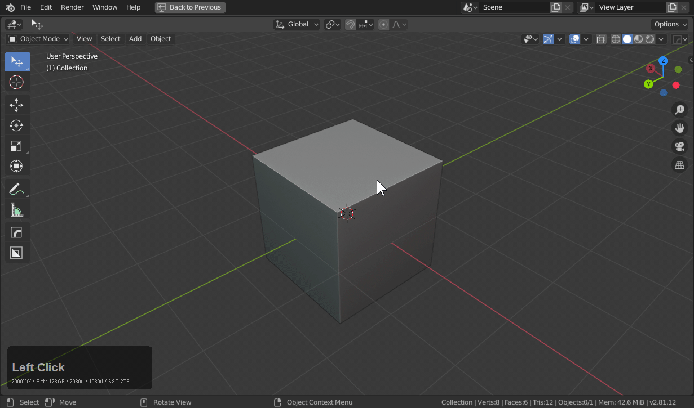
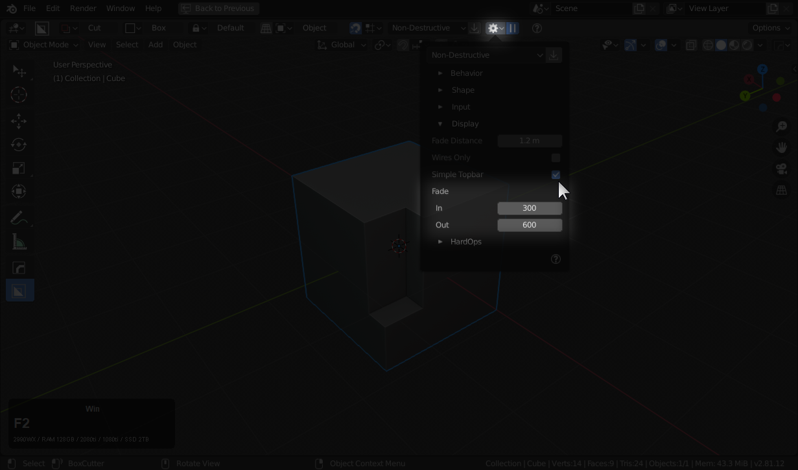
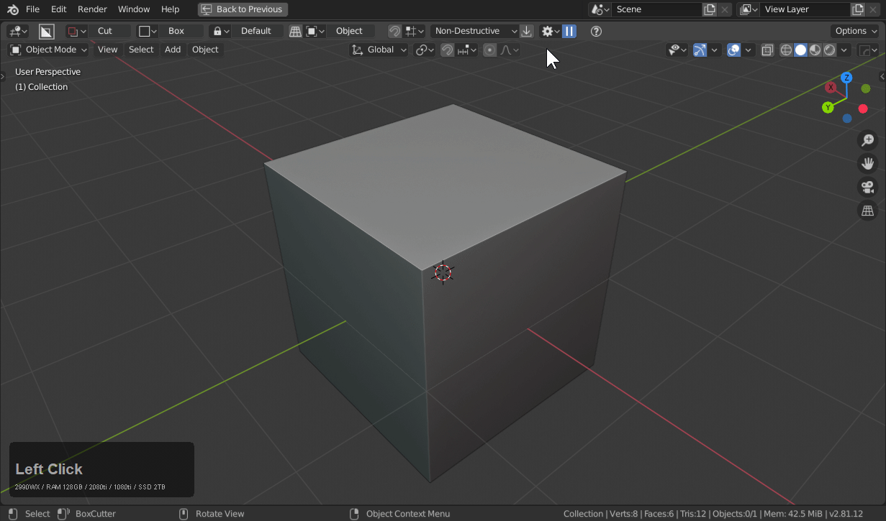

## Fade System

Fade was added to boxcutter as of version 714. It is a visual aesthetic for adjusting the fading of shapes on entry and exit.

Shapes now have the ability to fade into view and fade out of view. This has resulted in a much more graceful experience. This was the most time consuming portion of 714. Great care was taken to improve stability in order to support this system.
Fade times are in milliseconds. Set to low numbers to disable.

Fade options can be found in the topbar / D-pie.
In and out time is in milliseconds.

Fade adds shape afterfade for lazorcut, greybox, and repeat.

# Long fading

Setting the time high will result in multifade for multiple shapes.
Strangely they can even persist across new files if set high enough.

# Turning Off Fade

Setting fade to 1 will turn off fade. 

> I'd never turn off fade.
