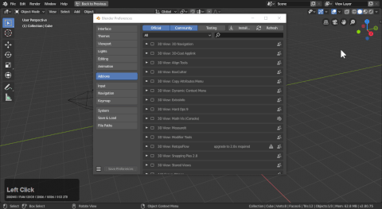

## FAQs and SFQs

# How do I install Boxcutter?

If updating Blender one must also update the Hard Ops / Boxcutter packages for the latest version.

1. Firstly ensure Blender 2.8 is up to date.

- [Buildbot Blender](https://builder.blender.org/download)

- [Blender Updater **Windows**](https://github.com/DotBow/Blender-Version-Manager/releases)

2. Ensure the latest zips are downloaded from the markets.

[Blendermarket](https://www.blendermarket.com/account/orders) /
[Gumroad](https://gumroad.com/library)

Gumroad Sales Pages (make sure you are logged in first)

[HardOps](https://gumroad.com/l/hardops) /
[Boxcutter](https://gumroad.com/l/BoxCutter) /
[HOPScutter Bundle](https://gumroad.com/l/hopscutter)

3. Edit >> Preferences >> Addons >> install from file. But this only works if the folder is not there already! Otherwise... issues.
In the addon panel locate Hard Ops / Boxcutter and delete them then you are able to install the newer update.
Make sure the folders are not there and it should work fine.

**(DO NOT try to install it on the blender install itself. That has shown to not work. ex: C:\Users\RUSER\Desktop\Blender Builds\2.8-updater\Git-f18373a9ab1a-25-May-23-18\2.80\scripts\addons - this is not the right place. See 3.**

> Alternatively you can copy the contents of the zip to the addons location.
C:\Users\YOUR USER\AppData\Roaming\Blender Foundation\Blender\2.8X\scripts\addons Remove any old HOPS / BC folders. Never overwrite.  

4. Open Blender and enable the add-on. I delete my config so blender would open cleanly without issue from previous prefs.

4a. If using install from file. As shown in the video. It will isolate the addon for enabling. After enabling do not double click while waiting. Just give it a second if you know you clicked it. Registrations can take a moment sometime.

And then Blender is able to be loaded and the addons enabled. Errors indicate that the HOPS/BC installation is possibly old and requires redownload. Also make sure it is installed in the correct path.

 

---
