## FAQs and SFQs

# How do you exit boxcutter?

W - press W

or choose any other active tool.

 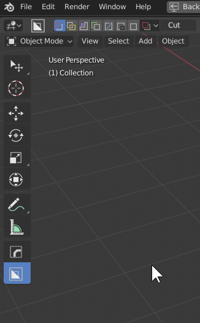

# Why can't I use space to move the shape?

Boxcutter was rewritten for 2.8 and many of the classic tools will have to be reproached. Transform will be added in a future update.
In the meantime tab for dots and shift to live is available for moving the shape after drawing.

# Help! I am using RMB select and cannot select multiple objects.

Extra hotkeys are added for our active tool state. Since it is based on default,
when using RMB select swap cursor button to other hotkey or uncheck it.
that should fix the problem with shift select.

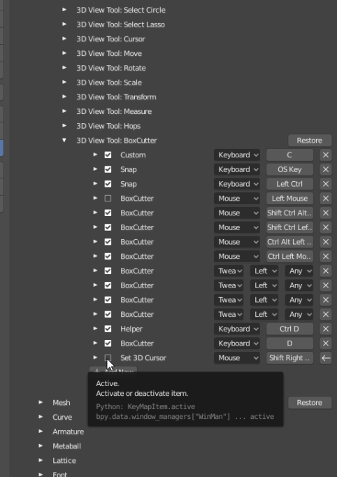

# How do I install Boxcutter?

If updating Blender one must also update the Hard Ops / Boxcutter packages for the latest version.

1. Firstly ensure Blender 2.8 is up to date.

- [Buildbot Blender](https://builder.blender.org/download)

- [Blender Updater **Windows**](https://github.com/DotBow/Blender-Version-Manager/releases)

2. Ensure the latest zips are downloaded from the markets.

[Blendermarket](https://www.blendermarket.com/account/orders) /
[Gumroad](https://gumroad.com/library)

Gumroad Sales Pages (make sure you are logged in first)

[HardOps](https://gumroad.com/l/hardops) /
[Boxcutter](https://gumroad.com/l/BoxCutter) /
[HOPScutter Bundle](https://gumroad.com/l/hopscutter)

3. Edit >> Preferences >> Addons >> install from file. But this only works if the folder is not there already! Otherwise... issues.
In the addon panel locate Hard Ops / Boxcutter and delete them then you are able to install the newer update.
Make sure the folders are not there and it should work fine.

**(DO NOT try to install it on the blender install itself. That has shown to not work. ex: C:\Users\RUSER\Desktop\Blender Builds\2.8-updater\Git-f18373a9ab1a-25-May-23-18\2.80\scripts\addons - this is not the right place. See 3.**

> Alternatively you can copy the contents of the zip to the addons location.
C:\Users\YOUR USER\AppData\Roaming\Blender Foundation\Blender\2.8X\scripts\addons Remove any old HOPS / BC folders. Never overwrite.  

4. Open Blender and enable the add-on. I delete my config so blender would open cleanly without issue from previous prefs.

4a. If using install from file. As shown in the video. It will isolate the addon for enabling. After enabling do not double click while waiting. Just give it a second if you know you clicked it. Registrations can take a moment sometime.

And then Blender is able to be loaded and the addons enabled. Errors indicate that the HOPS/BC installation is possibly old and requires redownload. Also make sure it is installed in the correct path.

 

---

# Why can't I cut with boxcutter mirror?

Make sure you are on the right side. The mirror starts where you left it so if you begin cutting on the wrong side you will have to reset the mirror and remirror.

> Notice how when I set the start operation it was already set to x+ which was where I left it and caused a slight confusion for a brief moment until the mirror was crossed

---

# How do I duplicate a cutter? And keep the boolean?

[see bc_transformer](https://boxcutter-manual.readthedocs.io/en/latest/widgets/#bc_transformer)

The bc_transformer is a widget for transforming or duplicating booleans.

---

# "How do I change inset "distance"? Like its width. Idk how to say it lol. I can't find anything about it in the documentation."

During draw. T changes the thickness.

The help shows this as well during draw.

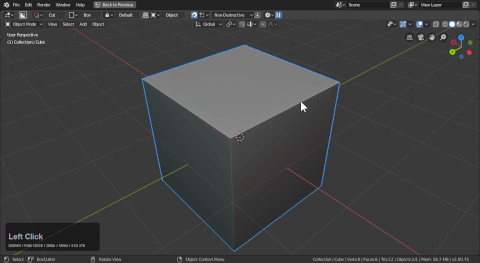

---

# I can't use the Industry Standard Kepmap with the ctrl + D helper!

This is because that keymap hardcodes hotkeys which replace the normal hotkey. For boxcutter to work you may have to remap or disable duplicate.

You can work around this with a small modification to the keymap.

---

# Inset issues w/ complex geometry and multiple bevels.

The trickier the surface w/ complexity, the harder of a time you will have with inset.

> Inset works well for the blocking in phase of models but once multiple levels of bevel are present it will more than likely omit the top levels.

It works fine with one level of bevel. Assuming the width isn't too big.

Let's try it with multiple levels. While it works the multiple levels were not taken into consideration to these situations must be handled differently.

---

# Why does my extrude go the wrong way?

Boxcutter extrudes in the direction of the normal. If your drawing goes the wrong way. You might want to enable face orientation to see normals.

Here you can see me  dealing with flipped normals and having to use E and O to extrude and offset.

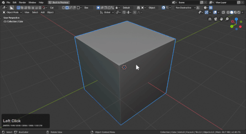

Getting the normals to be blue will get you back in action.

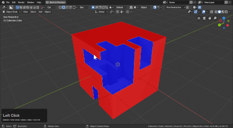

---

# I can't knife cut w/ mirror.

When knife cutting it might be needed to turn the mirror off temporarily.

Below you can see that in action.

---

# How do you knife cut with like the above image?

- Q: circle bool cuts are visible in edit mode to be able to see where to place the loop cuts at. How?
- A: unhiding the objects I need to see for adjustment.

To show using knife to cleanup on the fly.

A few things:

- *Knife will only show if wireframe display is on* hops >> alt + V >> wireframe
- knife requires you connect to an edge to work properly
- during ngon draw. C toggles cyclic line view which is handy for these sorts of operations.

> Notice that every cut goes off the model in some way or connects with a guidance line. This is the recommend way to approach this workflow.

Drawing in the middle of a face without providing assistance to solve will look like this.

Here is a better way to approach working this way:

> Notice the improved linework when guidance lines are provided.

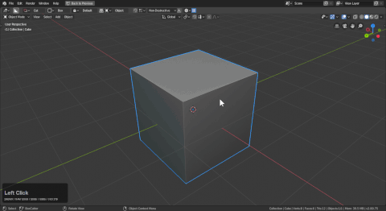

---

# Knife box material delete

Due to the abnormal workflow that created the Blue box it isn't without glitches. For example when knife box is used the material could disappear.
We are aware of this issue and hope to fix it but in the meantime but for now you will need to reassign the material.

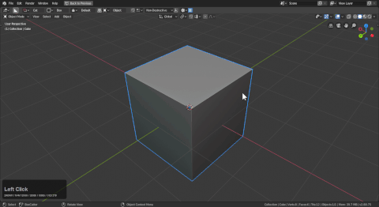

> After knifing use the alt + M hardops menu to reassign the material.

---

# When do I need a guidance loop?

Anytime you want to opimize a boolean solve.

Most of the time you can let booleans solve as they will. But working this way causes issues for the bevel mod due to long angular edges which also can affect starting orientation for drawing. Even with boolean topological quality guidelines apply.

If we cut boxes into a face without any assistance the result will look like this.

This can work in most cases but it could be better. Lets add a bevel modifier to see how this goes.

- bevel makes the surface look worse due to connections
- edges connecting to corners caused issues with bevel and its translation
- no guidance edges will cause these issues
- personally I solve just enough to avoid this stuff on the fly. Sometimes I'll cut cut cut then do a knife box to fix it
- *hops >> alt + V >> wireframe is essential for seeing these issues*

We can improve this with a few well placed knife box cuts. This strategy's purpose is to relieve the stress in corners with the bevel modifier and solving booleans. Sometimes user assistance is needed.

> This is due to blender solving as it wants by default. In the least efficieint way. So it is up to you the user to control this.

---

# Is there a difference between ngon solid and ngons line (cyclic)?

Only in the result. A line is very different than a solid.
When knifing the results will be almost the same. Except with cyclic your end point doesnt reconnect to the start.
Ngon cyclic works great for knife but cutting will require thickness.

In cut mode cyclic requires (t) thickness to work properly. Or with cut the default mode can be solidify for panel cuts.

To show cyclic ngon solidify in action.

 a few things to note:

 - without solidify as the start state I had to press T to add thickness
 - pressing C during draw cycles cyclic and normal.

With solidify on ngon it can perform almost the same except for the initial shape being either connected to the first point and a solid shape or a wire mesh with a solid mod.

They both have uses worth experimenting with to get the most out of each state. But cyclic ngon exists for a reason.

---

# Whats up with snap dots in ortho?

We are still figuring out the code for dots in front view. There is a difference between this view and all others that is giving us a bit of trouble.

The issue w/ snap dots in front look like this.

To show the issue in action.

---

# When I draw very small the shape doesn't show up. Why?

Boxcutter's repeat shape will trigger if the drawing is too small. You can fix this issue by adding more 00s to the lazorcut threshold in the behavior panel.

To show the issue in action.

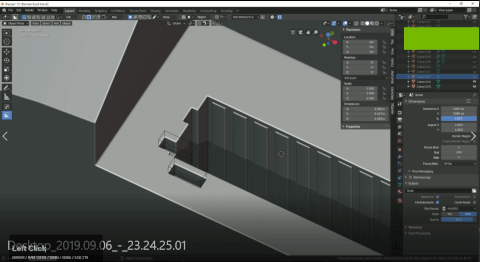

And demonstrated personally.

> Notice that adding more 00s to lazorcut limit made it easier to cut the smallest holes.

This is due to lazorcut and repeat being connected. In typical use cases shapes too small are rejected or converted to repeat which can be a gotcha with new customers.

---

# How do you set up circle to be reverse bevelled. Mine still have the spin modifier.

Keep mods keeps the selected modifiers live on a shape utilizing them.

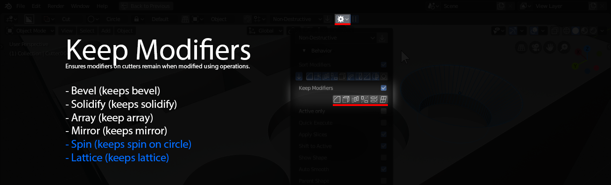

To show what it is like not keeping modifiers:

- bevel, solidify, array, mirror are on by default (this ensures being able to tweak afterwards)
- spin is applied so the center convergence can be dissolved resulting in a nicer circle
- lattice is never on. We turn this on for advanced diagnosis. Lattices are used by bc for placement so there is no need to keep lattices.
- you cannot reverse bevel an edge. Since the normals of an edge cannot be flipped.

> Only by applying spin can you use a boxcutter circle for reverse bevel in Hard Ops.

This video goes over the introduction of reverse bevel.

<iframe width="560" height="315" src="https://www.youtube.com/embed/6TdRQc1Grws" frameborder="0" allowfullscreen></iframe>

---

---

# [heavyPoly](https://www.facebook.com/groups/heavypoly/) config no work?

Installation

<iframe width="560" height="315" src="https://www.youtube.com/embed/aQKUCjTRzTk" frameborder="0" allowfullscreen></iframe>

- 1 - You open your Hpconfig blender, go in preferences/keymap and export your key configuration. 2 - For your new Blender setup,  you put all of the HPConfig files like usual except the config folder (The problem doesn't come from the plugins).

- 3 - In that new blender you go to preferences/keymap, import the old keymap

- 4 - you need to move your windows around to get the user interface similar (if you want) and then you are good! ALSO

- 5 - if you want the text file with the shortcuts, you go in your HPconfig Blender,  in the text editor tab, you choose save as to extract the file from the config,

- 6 - you load it in your new blender! easy peazy. You can now install Boxcutter and friends to your liking.

- 7 - Save the new  config by going into File/Defaults/Save Startup file

But it was still crashing when I use boxcutter, so I uninstalled every installation of Blender, I deleted the files from the folder that is allocated in %appdata%.

Then I download blender, HP Config and the addons and did all again and it worked, to be honest I don't know exactly what was causing the crash.

Maybe some files from previous installations

I hope it helps.

---

# Classic Update Guide

> same applies to any add-on like HardOps or KitOps

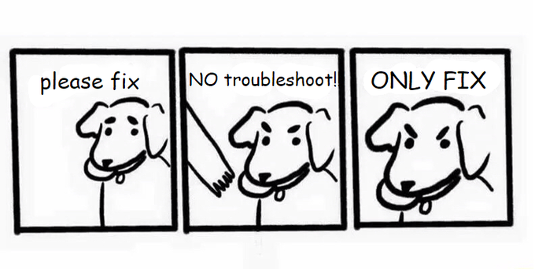

First things first. Update Blender 2.8. Next download the latest Boxcutter / HOPScutter package with the latest zip which is already in the market.

    - [94% of support issues involve needing to update 2.8](https://builder.blender.org/download)
    - [3% involve installing the add-on via copying the folder in the zip to the addon folder. Make sure to delete the old folder before copying over](https://www.youtube.com/watch?v=oMZrQ6ZHKm0)
    C:\Users\YOUR USER\AppData\Roaming\Blender Foundation\Blender\2.81\scripts\addons
    Windows Button + R >> Run >> %appdata%\Blender Foundation\Blender\2.81 (to access addons folder)
    - 2% involves using an older version of Boxcutter with a new Blender which causes a ” no attribute ‘tool mode’ ” error. Update Boxcutter / HOPScutter via the market.

If you updated Blender and the tools stopped working, update the tools as well. Update [Boxcutter](https://gumroad.com/l/BoxCutter) / [HOPScutter](https://gumroad.com/l/hopscutter) via the market.

    [1% involves other issues like topbar](https://twitter.com/mxeon1001/status/1123820309168177154)

# Obtaining Updates

As you know updates are always free. And we are committed to working with the latest version of [Blender](https://www.blender.org/)

[Blendermarket](https://www.blendermarket.com/account/orders)

[Logging into BlenderMarket using the dropdown and choosing orders will allow you to download the latest update.](https://www.blendermarket.com/account/orders)

If orders aren’t showing up under your account it is recommended to write the admins using the chat bubble on the side. Only the admins are able to resolve this issue.

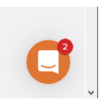

[Gumroad](https://gumroad.com/l/BoxCutter)

[Logging in via the button in the top right and accessing the sales page will allow you to view the product and download the latest update.](https://gumroad.com/library)

# Installation

<iframe width="560" height="315" src="https://www.youtube.com/embed/oMZrQ6ZHKm0" frameborder="0" allowfullscreen></iframe>

Place the folder from the zip in the local add-on directory.

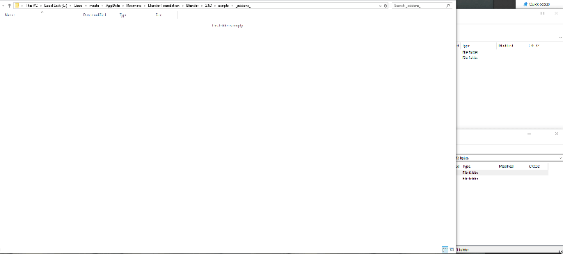

C:\Users\YOUR USER\AppData\Roaming\Blender Foundation\Blender\2.80\scripts\addons

Also remove any previous boxcutter folder before replacing it with the new one.

INSTALL FROM FILE CAN HAVE ISSUES IF THE FOLDER IS THERE ALREADY. PLACE THE ZIP IN THE SPECIFIED FOLDER TO ENSURE IT WORKS WITHOUT ISSUE. OR ENSURE THE FOLDER ISNT THERE AND USE INSTALL FROM FILE.

The next level of support involves deleting the /config which makes Blender open as new. If you have issues with the previous steps or are moving over custom configurations this can cause issues if the properties have existed for multiple itterations of 2.8. From time to time removing the config allows for clean installation and quick startup.

# Contact / Email

For support issues you can email me at masterxeon1001@gmail.com

However, I will also have you update Blender 2.8.

Also the help icon in Boxcutter takes you to the discord which I recommend for all users looking for a community to connect to.

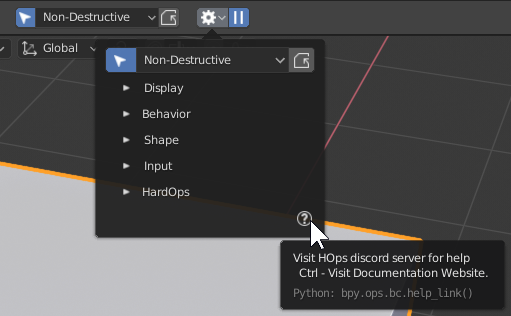

# Why am I experiencing crashes on Mac?

[BoxCutter](https://boxcutter-manual.readthedocs.io/en/latest/install/) appears to be having issues with the mac at this moment that can be resolved by opening blender via terminal. We are still working out why this is happening but appears to only be an issue on mac. We have been attempting fixes daily to resolve it but MacOS blender differs from Windows/Linux variants.

This was thought to have been resolved on 10-4-2019 but appears to still be occurring on mac. We are working on a fix as this is being written and should be up within the next 24 hours as we make progress.

[From the hops docs on the topic.](https://hardops-manual.readthedocs.io/en/latest/issues/#mac-help)

# How do I fix the issue on mac?

Running via terminal appears to be resolving the issue momentarily at this time but we are still checking into it.

