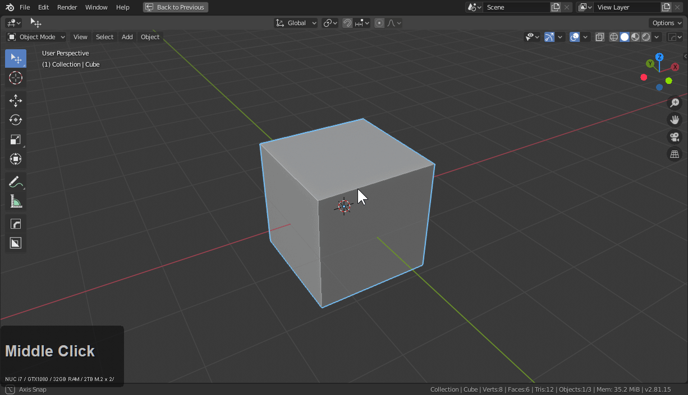
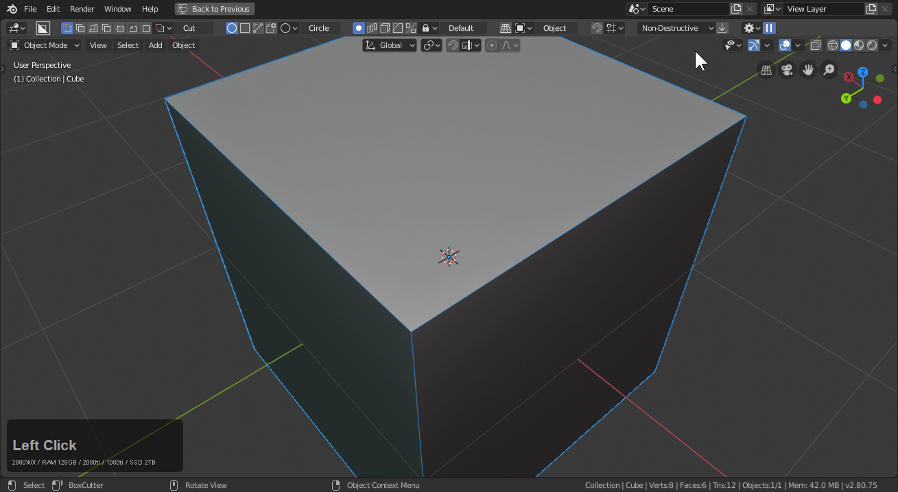

<iframe width="560" height="315" src="https://www.youtube.com/embed/H3093mifDoI" frameborder="0" allowfullscreen></iframe>

## Getting Started

> **Alt + W** starts boxcutter with **W** closing it and switching tool

Boxcutter is intended to be a fun time drawing and cutting shapes.

Once boxcutter is enabled a new icon appears in the T panel.

 > Notice how the topbar appears when the alt + W hotkey is used.

 

# Exiting BoxCutter

> **W** exits boxcutter (this works by changing the active tool to select)

As of 2.8 Boxcutter is an active tool which means to exit the tool one must simply select another tool.

 

# Finding your way around Boxcutter

Boxcutter has a help area inside of the N panel that populates with options as you work.

Fade is also new to 714 and dictates how shapes fade and appear. I recommend playing with high numbers and [even checking out the sound effects.](fade.md)

> During draw users can also press [tab to edit shapes.](dots.md)

# General Assistance

Boxcutter has a help button which can bring you to our channel for assistance.

As of 714 the option is also in the topbar in the highlighted area.

Help can also be found inside of the behavior panel at the bottom.

> It's also a nice place to report bugs and get noticed not to mention post art and chat!

# Applying booleans

Booleans can be applied using the button highlighted above.

You'll find in edit mode none of the booleans show if you have been working in non-destructive. As a result there is an option up top to apply booleans.

> You can even use boxcutter in edit mode. However it may have to be reactivated using the T panel icon or the **alt + W** hotkey.

# [Play with the various shapes](shapes.md)

[Box](shape_box.md), [Circle](shape_circle.md), [Ngon](shape_ngon.md) and custom are in boxcutter and can be a fun time for various things.

# Enable a sound effect

By setting the [fade exit to a specific number users can make sound effects](fade.md) occur!

> In this example an exit fade of 123 was used.

