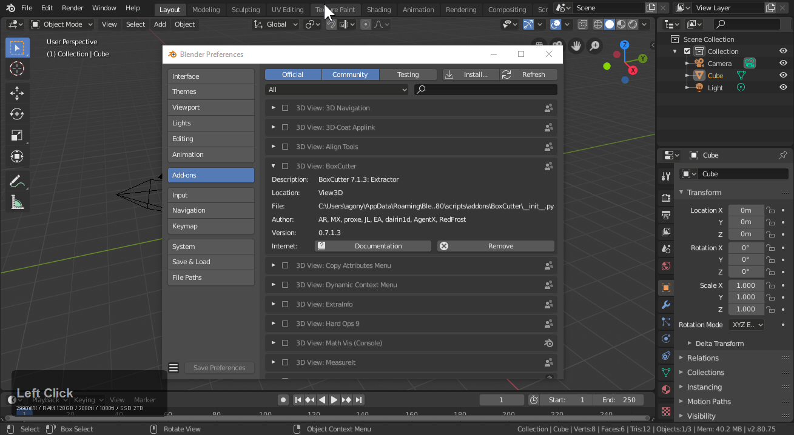
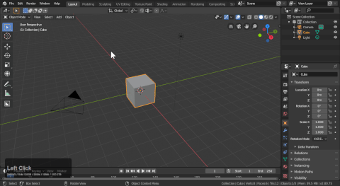
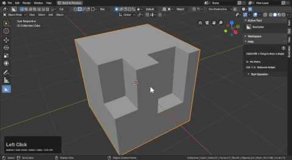

## Getting Started

Boxcutter is intended to be a fun time drawing and cutting shapes.

Once boxcutter is enabled a new icon appears in the T panel.

 > Notice how the topbar appears when the alt + W hotkey is used.

 

# Finding your way around Boxcutter

Boxcutter has a help area inside of the N panel that populates with options as you work.

# Applying booleans

You'll find in edit mode none of the booleans show if you have been working in non-destructive. As a result there is an option up top to apply booleans.

> You can even use boxcutter in edit mode.

# Play with the various shapes

Box, Circle, Ngon and custom are in boxcutter and can be a fun time for various things.

