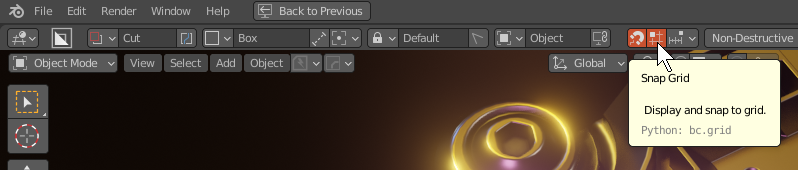

>> So many have dreams for us and grid but our aim first and foremost is being artistic. The next is to be nimble and provide tools essential to the goals of the user. Grid was always such an iffy addition due to grid having a very simplistic modelling appearance. 

# Grid

>> Gridfinite Grid was added back in 715 and the docs have been updated for the 717_18 update which aims to redefine the concept of the grid in Boxcutter. 

## Activating Grid

Grid is an icon in the topbar as well as the d pie and the n panel. It can even be toggled in the ctrl + D mini helper of boxcutter. 

The icon looks like this. 

# About Gridfinite 

>> The key thing about this grid is that it is infinite. However it also has a semitransparent edge to hide the boundaries and provide an endless experience. The goal is to have a grid where you need it and still be able to analyze things around it without limit.

# Getting Started w/ Grid

Getting started w/ grid is as easy as clicking the grid icon. 

Users can press ctrl during boxcutter to grab a face vector and go to work. The fade is exclusive to the border and allows for endless usage. 

Grid is supported across all tools.

# Grid Performance

Having a grid that is infinite means that a larger grid size is not needed due to the grid generating as you move. However adding more units than 10 can result in some heavy performance and is not recommended for slower PCs.

<em>Even I don't go past 10.</em>

Some of the lower configs look quite interesting.

2 gives us an idea for a future tool. And 0 is no grid at all and can be interesting to use as well. But grid is best enjoyed with 5-10 units for the best in performance and utility.  

# Grid Color

Grid is typically grey but in the examples I have grid color checked which makes the grid the same color as the cutter in use. This should be more useful for helping visually know what is about to happen.

This can be turned off under display in the behavior panel.

# Grid States 

## Surface Align

Surface align is a work in progress. When object is active the grid will attempt to orient to the surface for snapping via the grid. In the event of directional inaccuracy simply drawing without grid is more optimal.

## View Align

View align uses the classic systems from previous releases. Grid has not been integrated yet but will in the future. View align works in perspective and orthographic.

## Cursor

I am excited to say cursor has been improved dramatically. In this update the cursor can be used for grid positioning and orientation however I hope to create support tools for assisting with getting the perfect cursor alignment.

When it comes to using grid with cursor. Aligning the 3d cursor to an edge can be useful.

Then use cursor as alignment. This can come in handy for hard to reach areas.

## World 

Last but not least the fallback of fallbacks received the same updates. Now with grid the world is better positioned for level design and make box work.

