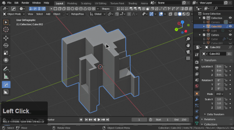
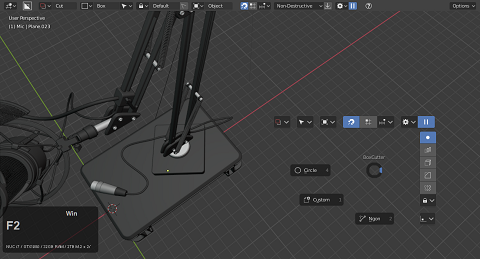
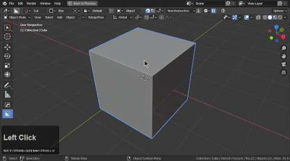
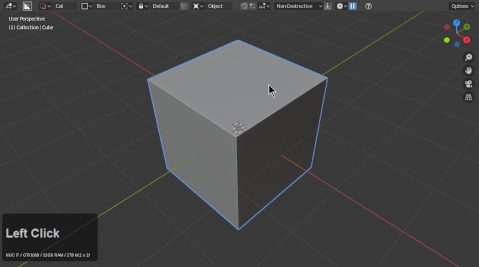
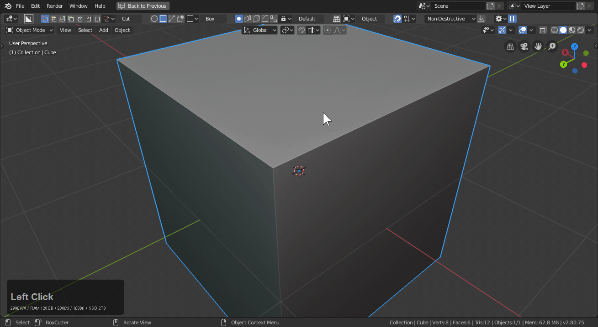
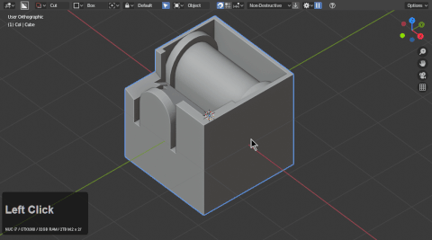
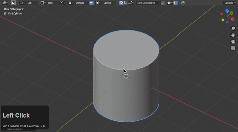
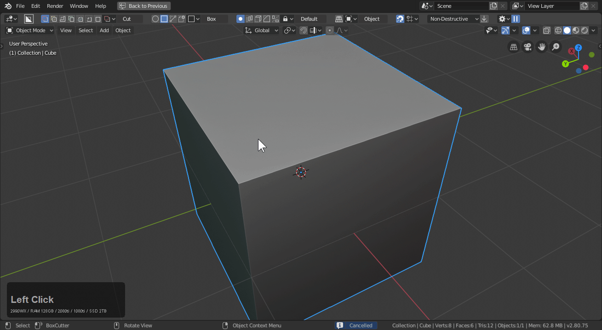

## General Hotkeys

To use boxcutter efficiently is to use the hotkeys. You can use boxcutter without them but it takes away from the speed and power we envision for this tool. We have dreams to make it more capable for tablets and be able to use this without a keyboard someday so as more systems are added this should get closer.

It is recommended to switch to the D helper for a more focused experience.

<iframe width="560" height="315" src="https://www.youtube.com/embed/videoseries?list=PLjqpj14voWsWksWGQp2Bb_8qldRlujmHm" title="YouTube video player" frameborder="0" allow="accelerometer; autoplay; clipboard-write; encrypted-media; gyroscope; picture-in-picture" allowfullscreen></iframe>

# Alt + W (start boxcutter)

Pressing alt + W (with your cursor in the 3d view) starts boxcutter. It will also make the topbar popup at the top of the screen.

<iframe width="560" height="315" src="https://www.youtube.com/embed/S4IiGGZVhBE" title="YouTube video player" frameborder="0" allow="accelerometer; autoplay; clipboard-write; encrypted-media; gyroscope; picture-in-picture" allowfullscreen></iframe>

<iframe width="560" height="315" src="https://www.youtube.com/embed/1SHhjt7rzMM" title="YouTube video player" frameborder="0" allow="accelerometer; autoplay; clipboard-write; encrypted-media; gyroscope; picture-in-picture" allowfullscreen></iframe>

> Without Boxcutter started none of the below hotkeys apply.

> Boxcutter's alt + W also switches with hopstool on the fly.

<iframe width="560" height="315" src="https://www.youtube.com/embed/HvzEzM7mSdE" title="YouTube video player" frameborder="0" allow="accelerometer; autoplay; clipboard-write; encrypted-media; gyroscope; picture-in-picture" allowfullscreen></iframe>

# W - Exit boxcutter

W changes active tool to select which changes the active tool from boxcutter thus exiting it.

# D (Pie menu / Boxhelper)

D will bring up a pie menu that has all the most important options handy.

> Circle, Custom, and Ngon are listed. The missing option is the active shape. In this case. Box. To maintain the appearance of the pie we show only the tools no active in the pie. Seeing custom only means another shape is selected.

> Looking at the topbar will also show what shape is active and in use.

As of 718_9 users can opt into having the Boxhelper as D instead of the pie however it has to be opted into.

<iframe width="560" height="315" src="https://www.youtube.com/embed/qCABKvC_peE" title="YouTube video player" frameborder="0" allow="accelerometer; autoplay; clipboard-write; encrypted-media; gyroscope; picture-in-picture" allowfullscreen></iframe>

# Shift + V - View Menu

Shift + V will show a view menu allowing for quick orientation checking or switching.

> Auto perspective is not recommended for use w/ BC so under view it can be seen as an option for disable if enabled.

<iframe width="560" height="315" src="https://www.youtube.com/embed/erccZPYVn2g" title="YouTube video player" frameborder="0" allow="accelerometer; autoplay; clipboard-write; encrypted-media; gyroscope; picture-in-picture" allowfullscreen></iframe>

# Ctrl + D (mini helper)

Ctrl + D during boxcutter will bring up a mini helper with options that change dynamically to be the most useful on the fly.

***Rotation angle pertains to rotation which is mapped to R***

<iframe width="560" height="315" src="https://www.youtube.com/embed/videoseries?list=PLjqpj14voWsWksWGQp2Bb_8qldRlujmHm" title="YouTube video player" frameborder="0" allow="accelerometer; autoplay; clipboard-write; encrypted-media; gyroscope; picture-in-picture" allowfullscreen></iframe>

# Ctrl (Snapping dots)

[Holding ctrl and moving the cursor over the mesh will reveal snapping dots for the enabled options.](snapping.md)

>Dots will only show if snapping is enabled and a highlight option is selected for the selection. These are intended for box, circle and custom.

If grid is disabled a single dot will show with snapping enabled to show orientation.

## Draw Modifiers

While boxcutter has many hotkeys for operations there are also modifiers for the drawing.

applies to:

- [box](shape_box.md)
- [circle](shape_circle.md)
- [custom](shape_custom.md)

# G - Grab / R - Rotate / S - Scale

X,Y, or Z to constrain to an axis.

Grab allows for free movement. It is based on the first axis drawn from.

***Shift dragging the offset dot allow for free translation***

Rotate allows for rotation.

Scale also lives up to it's name.

# Alt / Shift and Alt + Shift (during draw) Draw Modifiers

<iframe width="560" height="315" src="https://www.youtube.com/embed/PY7yk0cG5rc" title="YouTube video player" frameborder="0" allow="accelerometer; autoplay; clipboard-write; encrypted-media; gyroscope; picture-in-picture" allowfullscreen></iframe>

Box defaults to corner draw. Which looks like this:

- alt during draw will use center draw. This is useful with edge and face snapping dots.

- shift during draw will use uniform draw. This is less used but exists as a thing.

- shift + alt during draw will create a center square draw. This can be used to punch holes in shapes using a central face as the origin point.

> notice that circle uses center draw which doesn't require alt + shift. That can also be toggled to box as well eliminating the two hotkeys needing the be held.

## In-Tool Hotkeys

# About

During draw a variety of new options and hotkeys open up. They can be seen and followed via the N panel.

This is what should show in the help panel of the N panel

# LMB / Spacebar - confirm

Double-clicking or pressing spacebar will apply the shape and end the operation. Our tool is configured so that the next operation performed after a cut is cut due to boxcutter being an active tool. Pressing spacebar or double clicking before the extrude portion will trigger lazorcut.

> Quick execute is a mode of operation.
Lazorcut is the behavior of cutting through the object bypassing the extrude operation.  
Quick execute bypasses extrude to jump straight to lazorcut after the initial draw operation.
Release lock allows for the shape to be paused after draw allowing for fine translation.

***Pressing spacebar before extrude triggers lazorcut without allowing for extrude.***

# Shift + confirm - keep shape (shift to live)

Referred to as shift to live. If you are holding shift on confirmation you will keep the shape behind for editing. The sstatus of the shape will be boolshape so hardOps will be able to help with is as well.

<iframe width="560" height="315" src="https://www.youtube.com/embed/dsAYHfk5SDI" title="YouTube video player" frameborder="0" allow="accelerometer; autoplay; clipboard-write; encrypted-media; gyroscope; picture-in-picture" allowfullscreen></iframe>

# C / Alt + Scroll - cycle cutters

<iframe width="560" height="315" src="https://www.youtube.com/embed/hHjLp1mhLBE" title="YouTube video player" frameborder="0" allow="accelerometer; autoplay; clipboard-write; encrypted-media; gyroscope; picture-in-picture" allowfullscreen></iframe>

If you draw some shapes and alt + Scroll it will cycle cutters. Also pressing C will do it. This is scrolling the objects in the collection "cutters" so if nothing is present issues may occur.

<iframe width="560" height="315" src="https://www.youtube.com/embed/E6YGpKZpbJc" title="YouTube video player" frameborder="0" allow="accelerometer; autoplay; clipboard-write; encrypted-media; gyroscope; picture-in-picture" allowfullscreen></iframe>

# Shift + ~ - rotate shape inside

In the event you need to rotate the shape inside of the bounds you can press Shift + ~. This is not the same as traditional rotate which we plan to deal with via gizmo.

<iframe width="560" height="315" src="https://www.youtube.com/embed/WKfXdBwx2Rc" title="YouTube video player" frameborder="0" allow="accelerometer; autoplay; clipboard-write; encrypted-media; gyroscope; picture-in-picture" allowfullscreen></iframe>

# Tab - Edit Mode Dots / Pause Mode

<iframe width="560" height="315" src="https://www.youtube.com/embed/WKfXdBwx2Rc" title="YouTube video player" frameborder="0" allow="accelerometer; autoplay; clipboard-write; encrypted-media; gyroscope; picture-in-picture" allowfullscreen></iframe>

Tabbing during draw will lock the shape in a paused state for finer edit and rotating the view. [Dots will also be available](dots.md) for use for modification. G, S, and R is also available for use in pause mode.

In the event you are using LMB or alt + LMB to rotate view and encounter issues. There is this behavior to assist.

# Alt + D - Toggle Dots

Alt + D will toggle dots during draw. This can make for a quieter boxcutter experience.

# L - live toggle

Pressing L will keep the shape drawn live. Perfect for future edit. This can also be toggled in the behavior panel.

> Holding shift on apply of draw is the same as L for live. 

<iframe width="560" height="315" src="https://www.youtube.com/embed/mI3zOd8rYgg" title="YouTube video player" frameborder="0" allow="accelerometer; autoplay; clipboard-write; encrypted-media; gyroscope; picture-in-picture" allowfullscreen></iframe>

# E - extrude /  O - offset

When in paused state E will toggle extrude and O will toggle offset allowing you to adjust the extrusion on the top and bottom faces. This is mainly used from pause. But sometimes you will need this duirng draw to deal with flush.

> Hitting E a second time will toggle which face is being pushed.

Pressing O will adjust the offset of the top face only. Comparatively E is capable of doing both.

# H - toggle Wires

Sometimes the solid shape can get in the way. Pressing H during draw will toggle wire draw.

<iframe width="560" height="315" src="https://www.youtube.com/embed/D9R8qmBN7wc" title="YouTube video player" frameborder="0" allow="accelerometer; autoplay; clipboard-write; encrypted-media; gyroscope; picture-in-picture" allowfullscreen></iframe>

# X - slice

During draw pressing X will change to a slice.

> Also able to be toggled in the mini helper.

# Alt + X - Recut (mod of slice)

Recut is a modification of slice intended to cut and retrieve areas of the mesh previously removed via cutting. This available for both slice and inset. 

<iframe width="560" height="315" src="https://www.youtube.com/embed/ZYkGUwiwrqk" title="YouTube video player" frameborder="0" allow="accelerometer; autoplay; clipboard-write; encrypted-media; gyroscope; picture-in-picture" allowfullscreen></iframe>

<iframe width="560" height="315" src="https://www.youtube.com/embed/sF5BEeYjw94" title="YouTube video player" frameborder="0" allow="accelerometer; autoplay; clipboard-write; encrypted-media; gyroscope; picture-in-picture" allowfullscreen></iframe>

# X >> X - Intersect

Intersect is possible as of 716 and can be accessed via pressing X twice during draw.

<iframe width="560" height="315" src="https://www.youtube.com/embed/ahpKNvISIwc" title="YouTube video player" frameborder="0" allow="accelerometer; autoplay; clipboard-write; encrypted-media; gyroscope; picture-in-picture" allowfullscreen></iframe>

# X >> X >> X or I - Inset

I a toggles current shape into inset. During inset thickness can be adjusted with T and moving the mouse. There is also a property in the mini panel for this.

<iframe width="560" height="315" src="https://www.youtube.com/embed/1bDKfvHvdOw" title="YouTube video player" frameborder="0" allow="accelerometer; autoplay; clipboard-write; encrypted-media; gyroscope; picture-in-picture" allowfullscreen></iframe>

# Ctrl + X during Inset - Inset Slice

<iframe width="560" height="315" src="https://www.youtube.com/embed/uCAUpqBK6FE" title="YouTube video player" frameborder="0" allow="accelerometer; autoplay; clipboard-write; encrypted-media; gyroscope; picture-in-picture" allowfullscreen></iframe>

## Inset can also be examined via Debug

<iframe width="560" height="315" src="https://www.youtube.com/embed/ON-P1qUSxL8" title="YouTube video player" frameborder="0" allow="accelerometer; autoplay; clipboard-write; encrypted-media; gyroscope; picture-in-picture" allowfullscreen></iframe>

# J - Join

J toggles a union draw which is represented by green.

<iframe width="560" height="315" src="https://www.youtube.com/embed/tlwExsokW2M" title="YouTube video player" frameborder="0" allow="accelerometer; autoplay; clipboard-write; encrypted-media; gyroscope; picture-in-picture" allowfullscreen></iframe>

# K - Knife Box

K toggles knife box. Which is used for cutting edges into geometry.

> Requires wireframes to be showing to see.

<iframe width="560" height="315" src="https://www.youtube.com/embed/bBEDz6vd-l0" title="YouTube video player" frameborder="0" allow="accelerometer; autoplay; clipboard-write; encrypted-media; gyroscope; picture-in-picture" allowfullscreen></iframe>

# Shift + K - HOPS Mark (requires hardOps)

Hops mark will utilize hardOps marking preferences to mark the newly cut perimeter with sharpened lines. This can be useful for guiding quad remesher.

<iframe width="560" height="315" src="https://www.youtube.com/embed/v50cXf6B-2k" title="YouTube video player" frameborder="0" allow="accelerometer; autoplay; clipboard-write; encrypted-media; gyroscope; picture-in-picture" allowfullscreen></iframe>

# A - Make

A toggles make box which is just a regular box or shape. No booleans just a raw shape.

<iframe width="560" height="315" src="https://www.youtube.com/embed/i9g7oUy-gVY" title="YouTube video player" frameborder="0" allow="accelerometer; autoplay; clipboard-write; encrypted-media; gyroscope; picture-in-picture" allowfullscreen></iframe>

# Y - Extract

Extract is made to take booleans from a mesh and make it into a cutter. Pressing Y brings up the black box which is the extractor. This can be a fun time. Taking shapes out and giving them back to the surface. After extraction the mesh will be made into a custom cutter and primed for use.

<iframe width="560" height="315" src="https://www.youtube.com/embed/gljb2ggaN-Q" title="YouTube video player" frameborder="0" allow="accelerometer; autoplay; clipboard-write; encrypted-media; gyroscope; picture-in-picture" allowfullscreen></iframe>

# V - Array / V >> V - Radial Array

Pressing V will bring up array.

- scroll wheel to add / subtract to the count
- pressing V will toggle to radial array if an array is started
- press x / y or z to change axis
- press Shift + R to reset if the distance is out of hand.

> Array is always in a state of improvement so behaviors may differ from 713 to 714 and in subsequent releases. For example array axis was rotated with R previously but caused ngon misalignment issues so that had to be corrected.

<iframe width="560" height="315" src="https://www.youtube.com/embed/CXpEU2rX9UE" title="YouTube video player" frameborder="0" allow="accelerometer; autoplay; clipboard-write; encrypted-media; gyroscope; picture-in-picture" allowfullscreen></iframe>

# T - Solidify

Pressing T during draw will add thickness to the cut.

- pressing 1, 2, 3, adjusts the offset to be inside or outside

<iframe width="560" height="315" src="https://www.youtube.com/embed/DFExZObNf60" title="YouTube video player" frameborder="0" allow="accelerometer; autoplay; clipboard-write; encrypted-media; gyroscope; picture-in-picture" allowfullscreen></iframe>

# B - Bevel

Pressing B will bevel the shape.

- bringing the bevel in to 0 will lower segments to 1 and raise them to 6
- Q will bevel the underarea of the shape (cube / circle only)
- scroll wheel during bevel modal to increase / decrease segments

<iframe width="560" height="315" src="https://www.youtube.com/embed/oYuxtIuCIb4" title="YouTube video player" frameborder="0" allow="accelerometer; autoplay; clipboard-write; encrypted-media; gyroscope; picture-in-picture" allowfullscreen></iframe>

# Q - Contour Bevel

Pressing Q during B will trigger contour bevel. Pressing Q without B will jump into bevel then a second Q will go into contour bevel.

> In this state you may have to press B to toggle back to bevel and adjust the segements and amount modally since Contour Bevel is a state of bevel. This applies to times when the user goes from neutral shape to a Q contour bevel.

<iframe width="560" height="315" src="https://www.youtube.com/embed/1CwIcv_sWiM" title="YouTube video player" frameborder="0" allow="accelerometer; autoplay; clipboard-write; encrypted-media; gyroscope; picture-in-picture" allowfullscreen></iframe>

# 1, 2, 3, mirror

Press 1, 2, and 3 for mirror on the Xyz respectively.

- 1 for x axis
- 2 for y axis
- 3 for z axis
- press shift + number a to flip axis.

>>Be careful with the axis drawn on when using this as a start operation. It is a gotcha to draw on a side that has been bisected mirrored off. Be mindful of the axis you leave it in because it will not appear on the wrong side when this is set as a start operation.

<iframe width="560" height="315" src="https://www.youtube.com/embed/MmjiY1r05qE" title="YouTube video player" frameborder="0" allow="accelerometer; autoplay; clipboard-write; encrypted-media; gyroscope; picture-in-picture" allowfullscreen></iframe>

# C - Ngon Cyclic

Ngon typically draws manifold shapes but with C it can convert to a panel cut on the fly. 

Ngon also has a button on the topbar for toggling the cyclic state.

This can also be adjusted via the ctrl + D helper.

<iframe width="560" height="315" src="https://www.youtube.com/embed/LP2QNWdi19A" title="YouTube video player" frameborder="0" allow="accelerometer; autoplay; clipboard-write; encrypted-media; gyroscope; picture-in-picture" allowfullscreen></iframe>