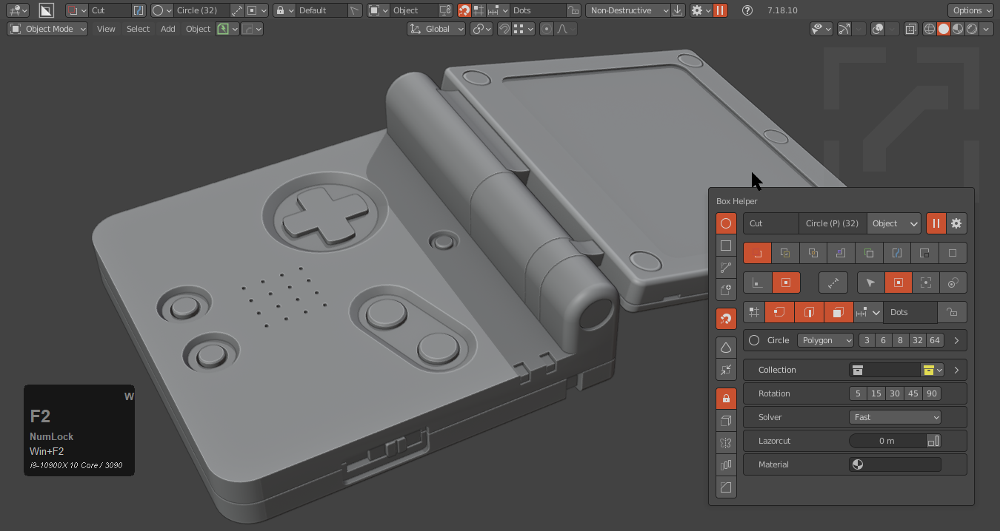
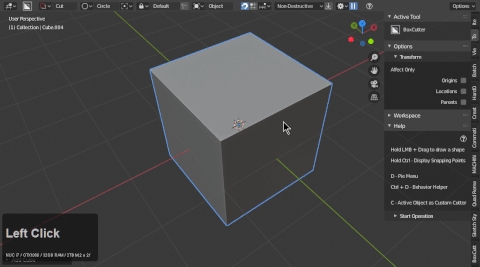
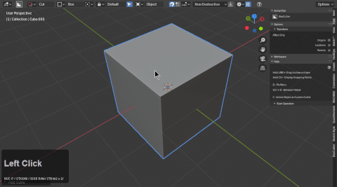
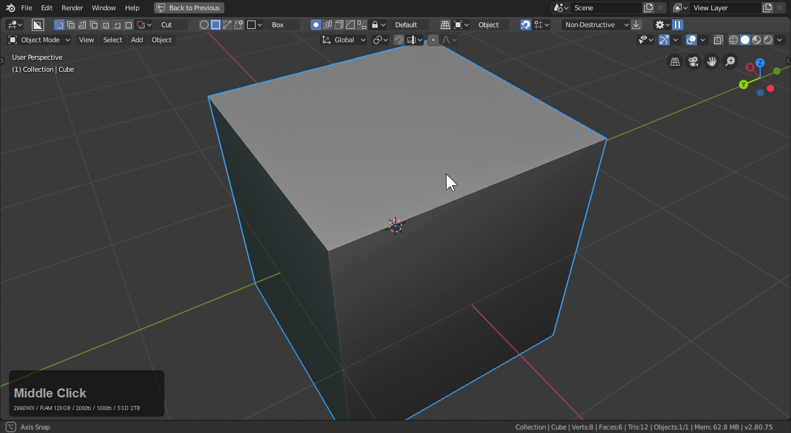

## General Hotkeys

# Alt + W (start boxcutter)

Pressing alt + W starts boxcutter. It will also make the topbar popup at the top of the screen.

# D (pie menu)

D will bring up a pie menu that has all the most important options handy.

# Ctrl + D (mini helper)

Ctrl + D during boxcutter will bring up a mini helper with options that change dynamically to be the most useful on the fly.

## In-Tool Hotkeys

# About

During draw a variety of new options and hotkeys open up. They can be seen and followed via the N panel.

This is what should show in the help panel of the N panel

# LMB / Spacebar - confirm

Double-clicking or pressing spacebar will apply the shape and end the operation.

# Shift + confirm - keep shape

Referred to as shift to live. If you are holding shift on confirmation you will keep the shape behind for editing. The sstatus of the shape will be boolshape so hardOps will be able to help with is as well.

# C / Alt + Scroll - cycle cutters

If you draw some shapes and alt + Scroll it will cycle cutters. Also pressing C will do it. This is scrolling the objects in the collection "cutters" so if nothing is present issues may occur.

# ~ / R - rotate shape

In the event you need to rotate the shape inside of the bounds you can press R.

R also resets array if it gets out of control.

# Tab - lock shape

Tabbing during draw will lock the shape in a paused state for finer edit and rotating the view.

# L - live toggle

Pressing L will keep the shape drawn live. Perfect for future edit.

# E - extrude

When in paused state E will toggle extrude and O will toggle offset allowing you to adjust the extrusion on the top and bottom faces. This is mainly used from pause. But sometimes you will need this duirng draw to deal with flush.

> Hitting E a second time will toggle which face is being pushed.

# O - offset

Pressing O will adjust the offset of the top face only. Comparatively E is capable of doing both.

# H - toggle Wires

Sometimes the solid shape can get in the way. Pressing H during draw will toggle wire draw.

# X - slice (during draw)

During draw pressing X will change to a slice.

> Also able to be toggled in the mini helper.

# Z - inset (during draw)

Z toggles current shape into inset. During inset thickness can be adjusted with T and moving the mouse. There is also a property in the mini panel for this.

# J - Join (during draw)

J toggles a union draw which is represented by green.

# K - Knife Box (during draw)

K toggles knife box. Which is used to cutting geometry with edges instead of boolean operations.

> Requires wireframes to be showing to see.

# A - Make (during draw)

A toggles make box which is just a regular box or shape. No booleans just a raw shape.

# Y - Extract (during draw)

Extract is made to take booleans from a mesh and make it into a cutter. Pressing Y brings up the black box which is the extractor. This can be a fun time. Taking shapes out and giving them back to the surface.

# V - Array / V >> V

Pressing V will bring up array.

- scroll wheel to add / subtract to the count
- press x / y or z to change axis
- press R to reset if the distance is out of hand.

# T - Solidify

Pressing T during draw will add thickness to the cut.

- pressing 1, 2, 3, adjusts the offset to be inside or outside

# B - Bevel

Pressing B will bevel the shape.

- bringing the bevel in to 0 will lower segments to 1 and raise them to 6
- Q will bevel the underarea of the shape (cube / circle only)

# Q - Contour Bevel

Pressing Q during B will trigger contour bevel. Pressing Q without B will jump into bevel then a second Q will go into contour bevel.

# 1, 2, 3, mirror

Press 1, 2, and 3 for mirror on the Xyz respectively.

- 1 for x axis
- 2 for y axis
- 3 for z axis
- press number a 2nd time to flip axis.

>>Be careful with the axis drawn on when using this as a start operation. It is a gotcha to draw on a side that has been bisected mirroed off. Be mindful of the axis you leave it in because it will not appear on the wrong side when this is set as a start operation.

