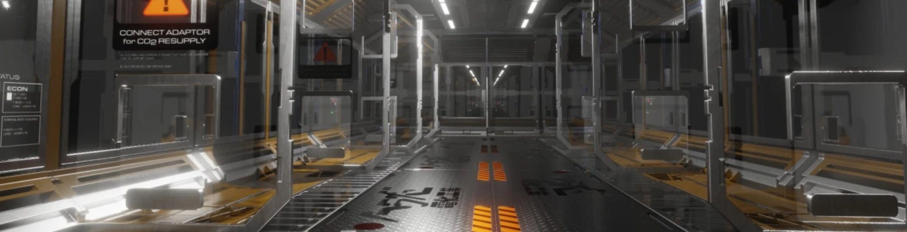
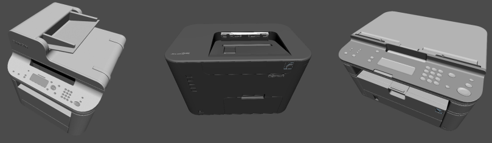
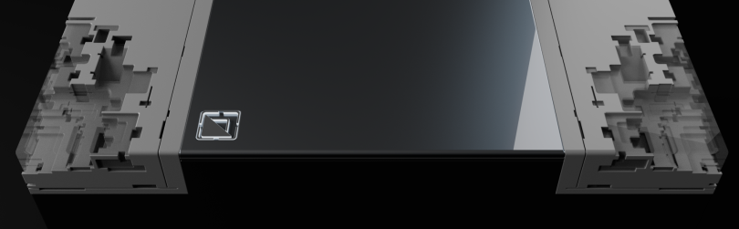
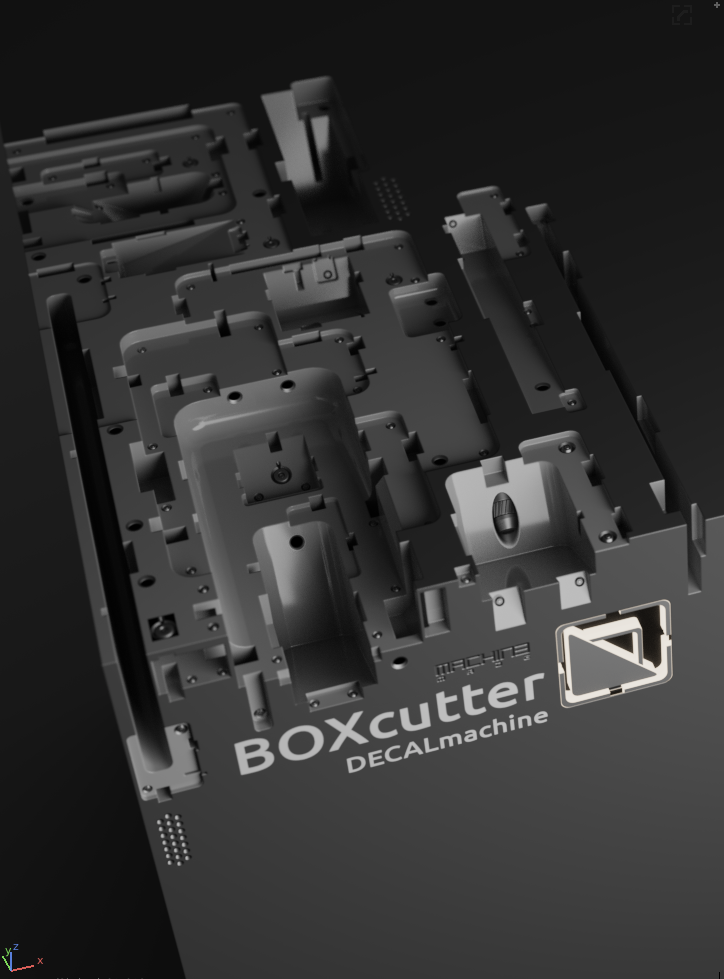

# What is [Boxcutter](https://gumroad.com/l/BoxCutter)?

[Boxcutter](https://gumroad.com/l/BoxCutter) is a [Blender 3d](https://www.blender.org/) plugin for concept design utilizing on screen drawing and hotkeys. It is being used by studios and companies all around the world and has been used in film, AAA games and even [cat helmet design](https://www.instagram.com/p/BseK8Nll34j/). As [Blender 3d](https://www.blender.org/) and [boxcutter](https://gumroad.com/l/BoxCutter) gain more traction we feel even more motivated to keep going. Boxcutter was the first such drawing based boolean product in all of 3D, and is currently still the most advanced and robust of it's kind in Blender.

<iframe width="560" height="315" src="https://www.youtube.com/embed/H3093mifDoI" frameborder="0" allowfullscreen></iframe>

The goal of each of our tools is to provide a first class AAA experience and most importantly, continue moving forward without stopping. Over 5000 hours have been spent creating, tuning and testing the Boxcutter technology and workflow. We take pride in our frequent release schedule and continual updates. Rarely is there a bug, that once identified, isn't fixed and an update released within 24 hours or at least addressed and planned for resolution. Our versatility is finding multiple ways to solve a problem so users can experiment with finding the best method. I take the upmost pride in this product and it's quality and can attest to the dedication of the team firsthand.

___

# Why is this [page](https://www.youtube.com/playlist?list=PL0RqAjByAphEUuI2JDxIjjCQtfTRQlRh0) here?

You wouldn't believe how many people asked for [boxcutter](https://gumroad.com/l/BoxCutter) docs. I guess [I talk too fast or move too fast in videos but now we have the means to educate the masses.](https://www.youtube.com/playlist?list=PL0RqAjByAphEUuI2JDxIjjCQtfTRQlRh0)

[So batten down the hatches, it's time to get learning.](https://www.youtube.com/playlist?list=PL0RqAjByAphEUuI2JDxIjjCQtfTRQlRh0)

___

# How did Boxcutter come about?

[Boxcutter](https://masterxeon1001.com/2016/04/26/box-cutter-guide-v1/) was first created by [AR.](https://twitter.com/AdrianRutk0wski/) [From the moment of this tools first inception we had great plans for it.](https://masterxeon1001.com/2016/04/26/box-cutter-guide-v1/) [Many have worked on this tool over the years](https://masterxeon1001.com/2018/09/25/boxcutter-6-9-0-poly-dirk/) but it wasn't until [proxe](https://twitter.com/proxeIO) [rewrote things for 2.8 with the future in mind](https://masterxeon1001.com/2018/11/30/boxcutter-7-2-8-betascythe/) did we get closer to the dreams we never knew we had. Even now we all still collaborate on ways to improve the tool and user experience while also trying to change the way things are done.

Boxcutter was an approach for a simpler more streamlined way to approach boolean modelling. HardOps had proven itself as focused workflow assistant and [boxcutter](https://gumroad.com/l/BoxCutter) was an attempt to reboot the whole idea with usability and simplicity in mind. Even now our work continues to inspire and guide future generations.

___

# History

[Boxcutter was first released April 26 2016.](https://youtu.be/drgcD9YqYUc) And from that moment it was a battle to survive.

This was the initial launch ad for boxcutter.

<iframe width="560" height="315" src="https://www.youtube.com/embed/drgcD9YqYUc" frameborder="0" allowfullscreen></iframe>

Boxcutter 690 was the final version for Blender 2.79 and remains in markets due to it still being popular.

This was the final ad of 2.79 for Boxcutter 690.

<iframe width="560" height="315" src="https://www.youtube.com/embed/9wqdXqtYQns" frameborder="0" allowfullscreen></iframe>

- [Boxcutter 6.9.0](https://masterxeon1001.com/2018/09/25/boxcutter-6-9-0-poly-dirk/)
- [Boxcutter 6.8.9](https://masterxeon1001.com/2018/07/24/boxcutter-6-8-9-interdimensional-ghostscythe/)
- [Boxcutter 6.8.8](https://masterxeon1001.com/2018/06/04/boxcutter-6-8-8-ghostscythe/)
- [Boxcutter 6.6](https://masterxeon1001.com/2017/09/21/boxcutter-6-6-update-notes/)
- [Boxcutter 6.5](https://masterxeon1001.com/2017/04/29/boxcutter-6-5-symslice/)
- [Boxcutter 6](https://masterxeon1001.com/2017/02/15/boxcutter-6-matscythe/)
- [Boxcutter 5](https://masterxeon1001.com/2016/09/30/boxcutter-5-switchblade-update-notes/)
- [Boxcutter 4](https://masterxeon1001.com/2016/05/28/box-cutter-4-update-notes/)
- [Boxcutter V1](https://masterxeon1001.com/2016/04/26/box-cutter-guide-v1/)

2.8 Marked the beginning of the 7 era for Boxcutter.

- [Boxcutter 7](https://masterxeon1001.com/2018/11/30/boxcutter-7-2-8-betascythe/)
- [Boxcutter 711](https://masterxeon1001.com/2019/02/15/boxcutter-711-release-notes/)
- [Boxcutter 712](https://masterxeon1001.com/2019/04/12/boxcutter-712-release-notes/)
- [Boxcutter 713](https://masterxeon1001.com/2019/07/10/boxcutter-713-release-notes/)
- [Boxcutter 714](https://masterxeon1001.com/2019/09/15/boxcutter-714-fadeblade/)

714 is the most recent release (as of writing):

<iframe width="560" height="315" src="https://www.youtube.com/embed/juZL5e5RU6s" frameborder="0" allowfullscreen></iframe>

From 2016 to this very moment we have been working on this tool and the refinement of the ideas we hope to convey. And to say the journey has been "eventful" would be an understatement.

Our competition is fierce but we're never one to give up. A good idea is bound to get around.

There are many imitators, but only one Boxcutter..

As our work continues the wheels keep turning. 2019 is the year of [boxcutter](https://gumroad.com/l/BoxCutter).

# 2.8 history

Many videos were done over the course of development chronicling the progress. Even now we continue to work on not only the tool but the way it is conveyed and educated. These videos serve as a nice overview of boxcutter the various features added to each release as the 2.8 era went on.

713 Reintroduction

<iframe width="560" height="315" src="https://www.youtube.com/embed/H3093mifDoI" frameborder="0" allowfullscreen></iframe>

DM - 003

<iframe width="560" height="315" src="https://www.youtube.com/embed/ju-1oXt_FO0" frameborder="0" allowfullscreen></iframe>

713 H0S3

<iframe width="560" height="315" src="https://www.youtube.com/embed/uWbPFC32SrM" frameborder="0" allowfullscreen></iframe>

712 Crazy Custom Cutters

<iframe width="560" height="315" src="https://www.youtube.com/embed/qvgwnUzEuwQ" frameborder="0" allowfullscreen></iframe>

712 Update Log

<iframe width="560" height="315" src="https://www.youtube.com/embed/Pww4RveWnZ8" frameborder="0" allowfullscreen></iframe>

712 Curved Cutting

<iframe width="560" height="315" src="https://www.youtube.com/embed/tEcVGpja44E" frameborder="0" allowfullscreen></iframe>

712 #boxcutter w/Commotion for logo animation in #b3d

<iframe width="560" height="315" src="https://www.youtube.com/embed/kpckhxuUKj4" frameborder="0" allowfullscreen></iframe>

711 Power Converter

<iframe width="560" height="315" src="https://www.youtube.com/embed/YIrthGmKhBo" frameborder="0" allowfullscreen></iframe>

711 Basic Introduction

<iframe width="560" height="315" src="https://www.youtube.com/embed/8qtEPLT2YnY" frameborder="0" allowfullscreen></iframe>

711 Spherical Eye Demo

<iframe width="560" height="315" src="https://www.youtube.com/embed/lEQF5rGituY" frameborder="0" allowfullscreen></iframe>

707 More Box More Cutter

<iframe width="560" height="315" src="https://www.youtube.com/embed/EAgYEjZNnpA" frameborder="0" allowfullscreen></iframe>

706 More Than Just a Box

<iframe width="560" height="315" src="https://www.youtube.com/embed/f_clPPu0tF0" frameborder="0" allowfullscreen></iframe>

706 Corridor Timelapse

<iframe width="560" height="315" src="https://www.youtube.com/embed/GTxNhcMR7gY" frameborder="0" allowfullscreen></iframe>

705 Green Additive Boxes

<iframe width="560" height="315" src="https://www.youtube.com/embed/9fpV33YCCmk" frameborder="0" allowfullscreen></iframe>

704 Enter Blue Box

<iframe width="560" height="315" src="https://www.youtube.com/embed/BJ7P2n1cAFY" frameborder="0" allowfullscreen></iframe>

703 Mirror Business

<iframe width="560" height="315" src="https://www.youtube.com/embed/m2Bz91OPcBc" frameborder="0" allowfullscreen></iframe>

702 New User Intro

<iframe width="560" height="315" src="https://www.youtube.com/embed/oycSgUn9rD0" frameborder="0" allowfullscreen></iframe>

702 Box City

<iframe width="560" height="315" src="https://www.youtube.com/embed/Y-TsPNlBfIc" frameborder="0" allowfullscreen></iframe>

690 Final Ad

<iframe width="560" height="315" src="https://www.youtube.com/embed/9wqdXqtYQns" frameborder="0" allowfullscreen></iframe>

___
