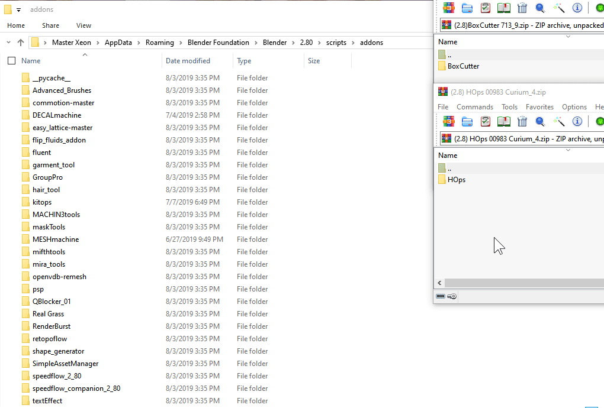
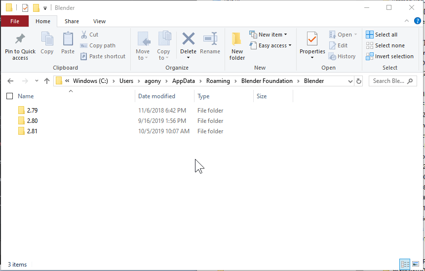
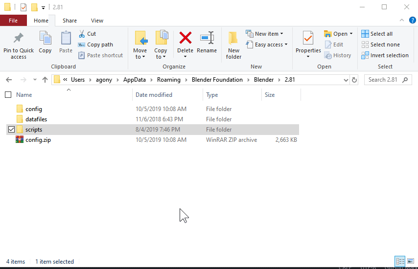

## Requirements

[Blender 2.8+](https://www.blender.org/)

The [official version](https://www.blender.org/download/) on the website is always supported first and foremost but the developments also cover [buildbot](http://builder.blender.org/).

---

## Installation Video

This video covers installation in depth making the rest of the page "extra".

<iframe width="560" height="315" src="https://www.youtube.com/embed/VCM9zJ2wm3c" title="YouTube video player" frameborder="0" allow="accelerometer; autoplay; clipboard-write; encrypted-media; gyroscope; picture-in-picture" allowfullscreen></iframe>

## Boxcutter Installation     

Updating Blender requires the latest updates.
https://builder.blender.org/download

If updating Blender one must also update the Hard Ops / Boxcutter packages for the latest version.

1. Firstly ensure Blender 2.8 is up to date.

- [Buildbot Blender](https://builder.blender.org/download)

- [Blender Updater **Windows**](https://github.com/DotBow/Blender-Version-Manager/releases)

2. Ensure the latest zips are downloaded from the markets.

[Blendermarket](https://www.blendermarket.com/account/orders) /
[Gumroad](https://gumroad.com/library)

Gumroad Sales Pages (make sure you are logged in first)

[Boxcutter](https://gumroad.com/l/BoxCutter) /
[HOPScutter Bundle](https://gumroad.com/l/hopscutter)

3. Copy the contents of the zip to the addons location.
C:\Users\YOUR USER\AppData\Roaming\Blender Foundation\Blender\2.8X\scripts\addons Remove any old HOPS / BC folders. Never overwrite.

3a. Or use install from file. But this only works if the folder is not there already! Otherwise... issues.
In the addon panel locate Boxcutter and delete them then you are able to install the newer update.
Make sure the folders are not there and it should work fine.

**(DO NOT try to install it on the blender install itself. That has shown to not work. ex: C:\Users\RUSER\Desktop\Blender Builds\2.8-updater\Git-f18373a9ab1a-25-May-23-18\2.80\scripts\addons - this is not the right place. See 3.**

4. Open Blender and enable the add-on. I delete my config so blender would open cleanly without issue from previous prefs.

4a. If using install from file. As shown in the video. It will isolate the addon for enabling. After enabling do not double click while waiting. Just give it a second if you know you clicked it. Registrations can take a moment sometime.

And then Blender is able to be loaded and the addons enabled. Errors indicate that the HOPS/BC installation is possibly old and requires redownload. Also make sure it is installed in the correct path.

---

## Detailed Install Instructions    

# Windows 10 / 7        

>When using Blender a folder is created deeply in your PC for add-ons. Putting it       
here instead of the branch you are using ensures the next updates also have it      
installed.      

C:/Users/ **USERNAME** /AppData/Roaming/Blender Foundation/Blender/ **2.XX** /scripts/addons        

# Mac       

>From finder in the Go dropdown holding command will expand and show Library where users can access the local data of Blender.

install from file in Blender works best.

<iframe width="560" height="315" src="https://www.youtube.com/embed/ZM_OWHtJsS8" frameborder="0" allow="accelerometer; autoplay; encrypted-media; gyroscope; picture-in-picture" allowfullscreen></iframe>

# Linux:        

>I assume linux users know their PC.        

~/.config/blender/ **2.XX** /scripts/addons     

## Support     

#Q: I can't install Boxcutter!      

>If no HOPS / BC folder is present in the local addons directory users should be able to install from file without issue. If the folder is there an error will occur.

Please remove the old boxcutter before installing a new version.
If a registration error occurs, close / reopen blender to refresh.

#Q: Boxcutter won't enable!       

>Try reopening Blender! Also check installation. Boxcutter latest version only works with Blender 2.8 and above. The api changes before will cause issues with old blender.  

# More about installation.

> When it comes to diagnosing issues with install a **screenshot of the issue would help with diagnosing errors**.

The easiest way to restore blender to defaults is to delete the config folder for your blender installation.

The local folder in windows is located at (depending on version):

- C:\Users\RUSER\AppData\Roaming\Blender Foundation\Blender\2.81
- C:\Users\RUSER\AppData\Roaming\Blender Foundation\Blender\2.80

> I tend to right click and send my config to a zip so it can be saved for later if needed. To restore it I can delete the new config folder and unzip the archive to this location to restore a previous setup.

**Install from file will not work if the addon is present**

For install from file to work you will need to delete the HOPS / boxcutter folders out of addons. This will ensure a clean installation.

# Rename 2.8x folder for testing reinstallation

Alternatively you can also try a clean install by just renaming the 2.81 folder and trying install from file then.

This is the method I use to test every support issue involving installation that customers write me about.

- renamed 2.81 folder to 2.81a so Blender won't load it.
- loaded up Blender which loaded full-screen **indicating prefs have been reset**
- installed Boxcutter / Hard Ops from file **notice the hang when installing from file**
- configured prefs for general experience

By renaming the 2.81 folder I can test a clean install. Afterwards I can delete the new 2.81 folder and rename the old one from (a) to just 2.81 and go on with working without losing my bookmarks, save history, and recent file history.

# Performing a clean install without deletion.

It is possible to rename the scripts folder and reinstall cleanly without deletion. This is how I test for installation with customer issues. Instead of removing everything I just put it to the side for a moment and then test with a clean setup. For a super clean install rename the 2.8x folder. Otherwise renaming scripts or prefixing it with an _ will help.

# Detailed Mac Install details.

>> 2.8X means X is the version you are dealing with. Could be 2.80, 2.81 and so on. Deal with the version you are currently trying to install.

<iframe width="560" height="315" src="https://www.youtube.com/embed/iS99DR1Chq4" frameborder="0" allow="accelerometer; autoplay; encrypted-media; gyroscope; picture-in-picture" allowfullscreen></iframe>

A key thing to note when dealing with bad mac installs is in videos you'll see me delete the internal 2.8X folder.

**This ensures the next attempt will be clean.**

Also if an install fails. **Close blender and reopen.**

Mac isn't my favorite OS due to having to make security exceptions with blender by clicking the spotlight icon in the mac toolbar and typing security.

Also to get to the 2.81 folder you have to have finder open so the toolbar says finder up top
when clicking go by holding option you can access library. It is hidden for some reason.

From there it is a short trek to where plugins and preferences are kept.
Library >> Application Support >> Blender >>

From here the versions are listed. These folders contain prefs, addons and other files associated with you as a user.

Before attempting any install I **delete the entire 2.8X folder**. This ensures blender loads with no prefs, history or addons.

Alternatively users could go further into  the specific install and delete just the folder.
ex: 2.81 / scripts / addons

and delete the folder of the addon giving issue.
ex: hardops or boxcutter

**This is the only way to ensure the install from file will work cleanly.**

Otherwise if the folder of the addon you wish to install is already present errors will occur.
Closing and reopening Blender after a failed install will also help make the situation easier to resolve.

On mac pressing Cmd + Shift + 4 will take a screenshot and put it on the desktop.
Showing us any errors you receive will assist in diagnosing any issues.

<iframe width="560" height="315" src="https://www.youtube.com/embed/m0AyFhq1GL0" frameborder="0" allow="accelerometer; autoplay; encrypted-media; gyroscope; picture-in-picture" allowfullscreen></iframe>
