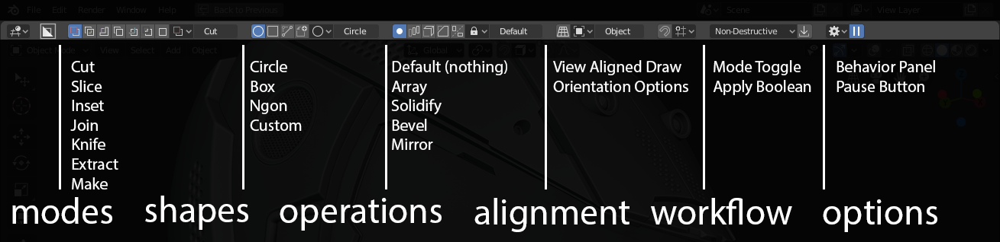
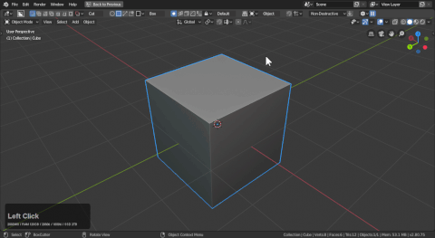
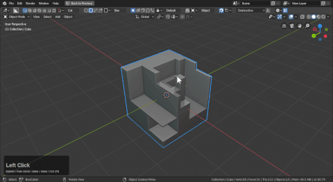

## Interface

Boxcutter can be started from the T panel.

 

It can best be started with the [hotkey alt + W.](hotkeys.md)

> Notice how the topbar pops up when [alt + W](hotkeys.md) is used.

Boxcutter can be started via clicking the words "activate boxcutter" in the N panel.

The topbar is the main interface of boxcutter and also is in the N panel and the active tool panel.

# Breaking down the topbar

# Basic Overview

Modes is the type of cutters available

- cut
- slice
- inset
- join
- knife
- extract
- make

Shapes are the various draw types.

- circle
- box
- ngon
- custom

Operation or start modifiers

- default
- array
- solidify
- bevel
- mirror

Alignment options

- view aligned draw (used for overriding surface draw)
- orientation options (world, object, 3d cursor)

> View Align toggle

> Orientation toggle

Workflow options

- destructive / non-destructive toggle
- apply booleans

> Destructive / Non-destructive

> Apply Booleans

Options / Pause Panel

- behavior panel sprocket
- pause button

> Pause button is used to make the boolean operation calculate at the end of the operation otherwise all drawing is live edit.

# Topbar Customization

The toolbar can be customized in depth and can be quite powerful for operational usage.

# D pie

When boxcutter is active there is a D pie menu that allows you to change most operational features on the go. This contains most of the options in the topbar and is my goto interface item for using boxcutter.

As shown below the pie menu can

# Ctrl + D mini helper

For those who find the D menu too daunting and needs to make more rapid decision on the fly the ctrl + D is also available while in the boxcutter active tool.

> This was made with intentions of being nimble and quick so most of the options here are context related. You wouldn't see most options.

