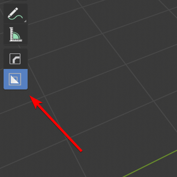
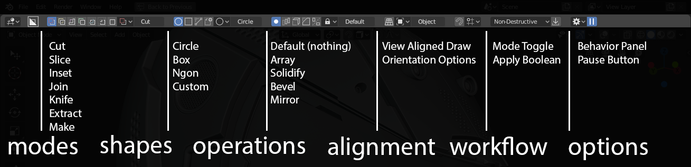
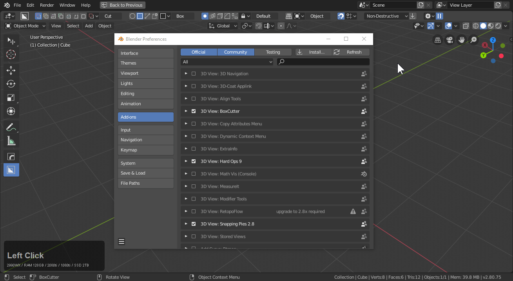
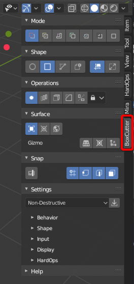
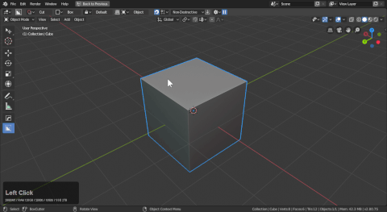
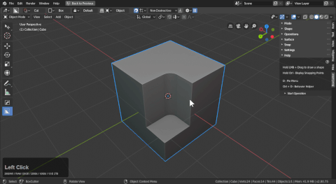

## Accessing Boxcutter

Boxcutter's interface can be accessed via the following methods:

- topbar
- N-panel
- D-Pie

> These are only available while boxcutter is the active tool with [alt + W.](hotkeys.md)

> Boxcutter is also able to be started using the T panel icon.

___

# Topbar

The current topbar system contains the entirety of the boxcutter workflow in a dynamic and adjustable [topbar](https://twitter.com/mxeon1001/status/1123820309168177154).

- [modes](modes.md)
- [shapes](shapes.md)
- [operations](operations.md)
- [alignment](alignment.md)
- [workflow](workflow.md)
- [options](preference.md)

The topbar can also be adjusted via preferences to be even smaller and nimble depending on preference.

> Simple topbar was a new option added for simplicity for those who like it.

___

# N - Panel

Pressing N opens the n panel which has a tab for Boxcutter.

This place is also capable of [displaying the hotkeys.](hotkeys.md)

> You may have to collapse the panel to see the hotkeys.

There is also a tool area that is capable of not only starting boxcutter but displaying the hotkeys during operation.

> The Npanel isn't recommended for interacting with the shape during the draw. Clicking in the npanel during draw will more than likely confirm the operation.

___

# D - Pie

> D will only bring up the pie while boxcutter is active. To use other tools with D pies like decal machine press W to exit the active tool.

The d-pie is the most common way to interact with boxcutter pre-draw. This pie menu is optimized for setting up behaviors, changing cutters and most of the functions you would need the topbar for. Because the pie spawns near the cursor it is faster and a more predictable way to deal with boxcutter.

To show it in action.

The d-pie is the recommended way to configure boxcutter pre-draw.

___

# Ctrl + D - Mini helper

> Hard Ops has shown that micro helpers focused on usability is optimal for workflow efficiency. As a result this ideology has enhanced Boxcutter.

The mini-helper is essential for changing operations on the fly. For example when adding a bevel maybe you'd like a slider or preferences to adjust mid-operation. The mini helper is there for you. This tool is optimized to show only the options users need to keep it as small and useful as possible. Users have shown a fondness to this almost over the D-pie but they each have their uses.

- D pie is for making changes before drawing.
- Ctrl + D helper is for making changes mid operation

> mini helper also works pre operation

> mini helper only shows the most relevant information

To show the D helper in action:

