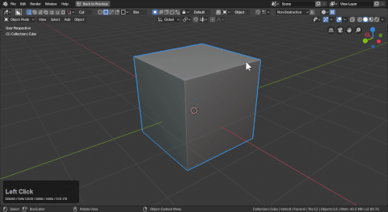

# What is a modal?

# About modals.

To quote the api:

"Grab, Rotate, Scale and Fly-Mode are examples of modal operators. They are especially useful for interactive tools, your operator can have its own state where keys toggle options as the operator runs."

When you perform an operation like Grab or bevel in edit mode you are in a modal. This type of operation takes over the whole interface until it is over. This is different than active tools which can be used and stopped with a choice of continuing / repeating or discontinuing.

Below is that in action.

You can tell a blender modal by the info text up top and the hotkeys down below. I hope to see boxcutter doing that someday.

# What about modals

So when you start an operation you are in a modal for example: drawing. During this state a plethora of hotkeys open up but so does the potential for additional issues that could lead to issues that cascade into a crash.

To see the hotkeys in boxcutter you can extend the help area of the N panel.

Notice how the hotkeys populate during the draw offering me more options.

The state during this draw is a modal. So while it may seem like the N panel is a good way to interface: it has shown to have issues with responsiveness compared to say the ctrl + D mini helper.

I don't personally recommend using boxcutter out of the N panel due to the delay in the actual props catching up or not working as intended.

Using the ctrl + D mini helper the interactivity is closer to what we intend. The same thing goes for the D pie. That is intended for use before drawing.

These aren't strict rules just recommendations on how to get the best experience with the least amount of issues. Also don't fall for any F6 panels in boxcutter. We don't use them in boxcutter. So more than likely changing the F6 will cause a crash.
