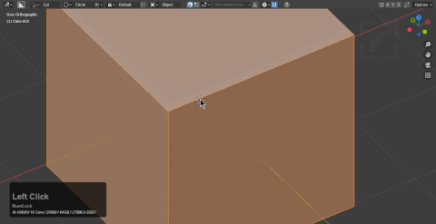

# Mode: Extract

> Extract can also be used in edit mode.

Hotkey >> Y (during draw)

Extract is intended to take the underlying surface and convert it into a cutter.

As of 71V extract is also capable of taking surfaces.

<iframe width="560" height="315" src="https://www.youtube.com/embed/gljb2ggaN-Q" frameborder="0" allow="accelerometer; autoplay; encrypted-media; gyroscope; picture-in-picture" allowfullscreen></iframe>

# Edit Mode Extract

Extraction can be used in edit mode which will switch to custom cutter with the resulting extraction.

# Using active Only as a jumpoff point

Active only seems useless however not being able to cut the secondary selection and instead use it for obtaining orientation is a powerful feature.

I used object scroll from hardOps to get the cutter for the main cylinder that I used to orient my extraction to. I tend to start in red just to see what I'm going to take disappear and then press Y to toggle before application to extract.
