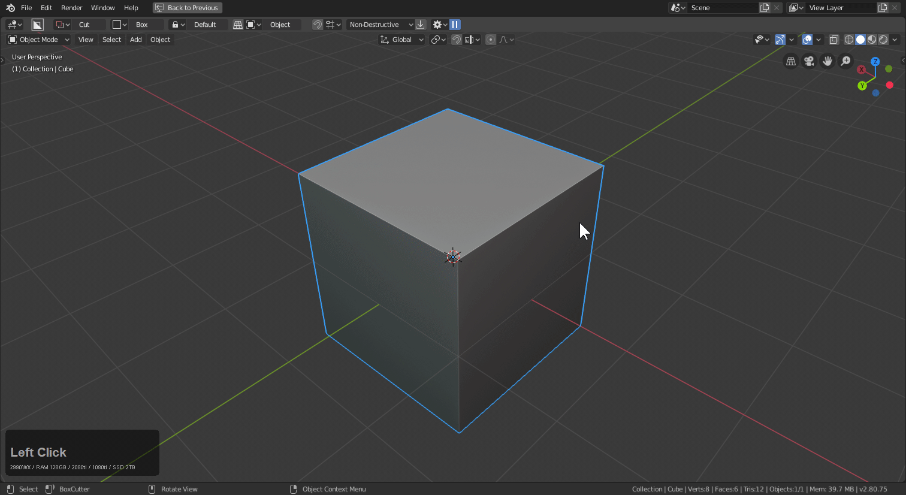

# Mode: Blue Box

Hotkey >> K (during draw)

Blue cut is for knife. When using this tool the geometry will be implied on the mesh. In order to see it you will have to enter edit mode or enable wire view in the 3d view.

I normally use this to clean up booleans or prepare linework for bevels.

# Blue w/ Ngon Cyclic

When using ngon c will cycle cyclic. If you use this with knife you can cut lines into models and with wireframes showing you can efficiently clean up booleans.

> Having lines that don't converge with corners will result in smoother shading and a better result with the bevel modifier.

# Knife cut w/ mirror issues.

When knife cutting it might be needed to turn the mirror off temporarily.

Below you can see that in action.

For some reason this only happens with the hardOps mirror at this time.

# Knife box material delete

Due to the abnormal workflow that created the Blue box it isn't without glitches. For example when knife box is used the material could disappear.
We are aware of this issue and hope to fix it but in the meantime but for now you will need to reassign the material.

# Classic videos on Blue Box

Boxcutter 704 was the reintroduction of blue box in it's 3d form. This video shows me re-introducing the 2.8 version to users. It was the main focus of this video and should give some insight.

704 Enter Blue Box

<iframe width="560" height="315" src="https://www.youtube.com/embed/BJ7P2n1cAFY" frameborder="0" allowfullscreen></iframe>
