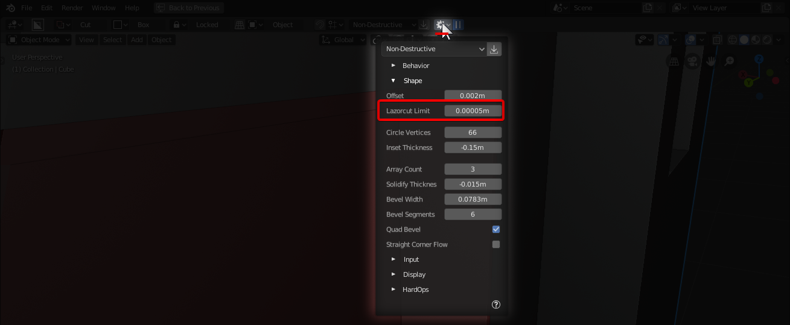

# Mode: Green

Hotkey >> J (during draw)

Green is for union. When in this mode shapes will be additive instead of subtractive.

When using union it is important to note:

- bevel will be flipped automatically to prevent issues
- if used as a start state the drawing will also be reversed

# Union Use Cases

There comes a time when one must add to a model.

# Green Auto offset

Union green mode will offset the mesh to ensure the boolean result is flush with the mesh. This can be adjusted with the boxcutter behavior panel in the topbar or D-pie.

To show adjustment of the offset in action:

> When drawing with mode cut there is an offset the opposite way. That means you have to move the cutter .0001 blender units to cut. With join the offset is opposite. This is important to keep in mind if you start in union but switch using X to cut or Z to extrude. The offset will be different due to the behavior of the union green mode.

# Union Green classic Videos

705 was the reintroduction of green box and this classic video shows how green box is used in action as well as discussing it in the scheme of boxcutter.

705 Green Additive Boxes

<iframe width="560" height="315" src="https://www.youtube.com/embed/9fpV33YCCmk" frameborder="0" allowfullscreen></iframe>
