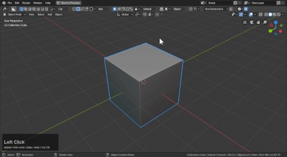

# Mode: Grey / Make

Hotkey >> A (during draw)

Make shape does what the name says. It simply makes.

Press A during a cut to toggle to make.

When no object is selected the make will trigger automatically since you can't cut a non-selection.

> When drawing this way the orientation changes to world.

# Use Cases

Drawing from the ground using snapping dots.

Sketching from the side.

