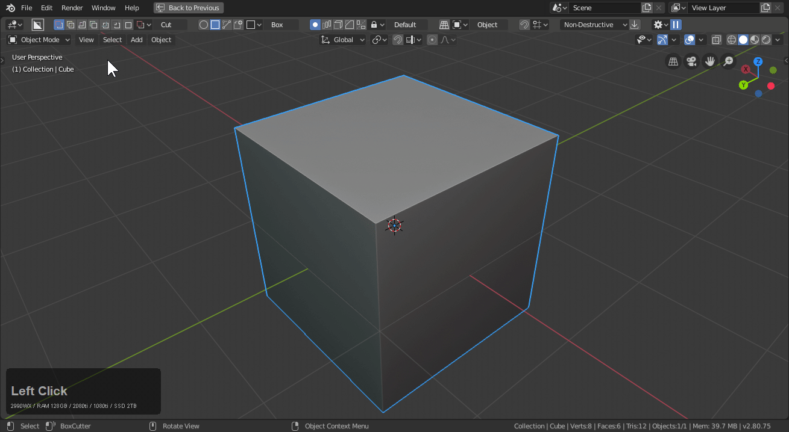

# Mode: Inset

Hotkey >> Z (during draw)

Purple cut is inset. This will slice the mesh, add a solidify and push the mesh inwards.

> Since this uses the solidify large values will get problematic.

Pressing T during operation will adjust the thickness but also pressing ctrl + D brings up the mini helper for fine adjustment.

# Inset w/ Curved surfaces.

Inset works especially well with curved surfaces.
That can be seen in the example(s) below.

# Behaviors

Inset has no preset specialized behaviors at this time.

##  Things to be aware of with inset.

# Inset can have issues w/ complex geometry

The trickier the surface w/ complexity, the harder of a time you will have with inset.

> Inset works well for the blocking in phase of models but once multiple levels of bevel are present it will more than likely omit the top levels.

It works fine with one level of bevel. Assuming the width isn't too big.

Let's try it with multiple levels. While it works the multiple levels were not taken into consideration to these situations must be handled differently.

