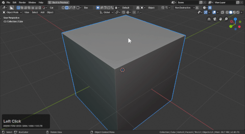
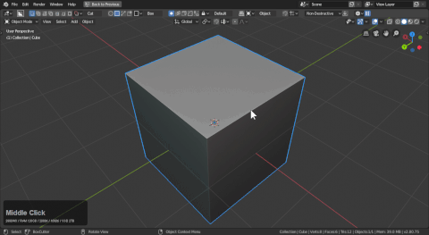

# Mode: Cut

Hotkey >> X (during draw)

Red cut has only the purpose of cutting. Users can toggle from any other state to cut using X.

# Applying booleans

While working in non-destructive booleans are kept live. You can apply them by using the apply booleans button in the topbar.

# Pause mode

In the corner of the topbar is a pause button that can let you pause the boolean operation for after confirmation. This can be useful when the viewport begins getting slow or there's performance issues.

> I rarely use this but it is worth mentioning.

## Behaviors

- Active Only

- Quick Execute

- Shift to Active

- Show shape

- Autosmooth

- Parent shape

- Autohide

