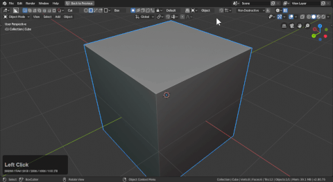
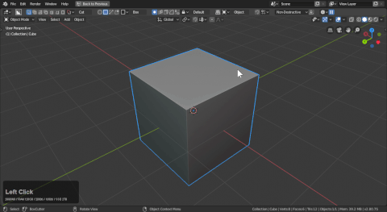

# Mode: Cut

Hotkey >> X (during draw)

Red cut has only the purpose of cutting. Users can toggle from any other state to cut using X.

# Applying booleans

While working in non-destructive booleans are kept live. You can apply them by using the apply booleans button in the topbar.

You may need to go back and delete the collection as well to delete the cutter shapes.

# Pause mode

In the corner of the topbar is a pause button that can let you pause the boolean operation for after confirmation. This can be useful when the viewport begins getting slow or there's performance issues.

> I rarely use this but it is worth mentioning.

## Behaviors

- Active Only

- Quick Execute

- Shift to Active

- Show shape

- Autosmooth

- Parent shape

- Autohide

# Classic Videos On Cut

When boxcutter was first ported to 2.8 only box and cut / slice was present. These videos serve as a nice history lesson and showing these features without all the additional extras.

703 Mirror Business

<iframe width="560" height="315" src="https://www.youtube.com/embed/m2Bz91OPcBc" frameborder="0" allowfullscreen></iframe>

702 New User Intro

<iframe width="560" height="315" src="https://www.youtube.com/embed/oycSgUn9rD0" frameborder="0" allowfullscreen></iframe>

702 Box City

<iframe width="560" height="315" src="https://www.youtube.com/embed/Y-TsPNlBfIc" frameborder="0" allowfullscreen></iframe>
