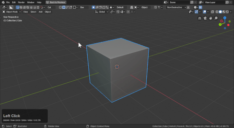
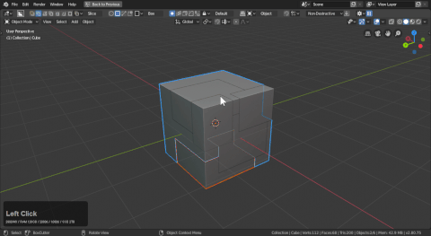

# Mode: Slice

Yellow box is for slicing. When used the drawn shape will be cut from the object.

In non-destructive mode it can be confusing when going into edit mode but the apply button in the topbar will make the slices real.

# Behavior Apply slices

Applying slices on the fly can come in handy for modelling non-destructive and destructively at the same time. Sometimes you only want to apply the slice operation and keep the previous operations intact.

