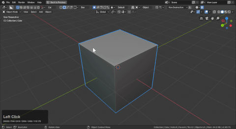

## Modes

# Drawing Modes

Boxcutter currently has 7 draw modes.

- [cut](mode_red.md)
- [slice](mode_yellow.md)
- [inset](mode_purple.md)
- [join](mode_green.md)
- [knife](mode_blue.md)
- [extract](mode_black.md)
- [make](mode_grey.md)

The links for the names go more in depth on each of them.

___

# [Cut](mode_red.md) (in-mode hotkey: X)

Cut subtracts using a difference boolean to the mesh while drawing and extruding the user created shape live.

Cut can be used in object and edit mode as well and possesses alternate draw modes of uniform and square. This tool can also be shifted to live and is the most popular cutter.

# [Slice](mode_yellow.md)(in-mode hotkey: X)

Slice duplicates the mesh while using difference on the primary and intersect on the secondary. This tool has variety of uses and can also do material cutting.

> Apply slices in the behavior panel will apply the slice bringing more sanity to the object when going into edit mode. Apply slices can have issues with hshapes sometimes however so be mindful of it's inclusion. At this time it works with single slicing but gets messier with multislice apply.

# [Inset](mode_purple.md)(in-mode hotkey: Z)

Inset is one of the few cutters made for curved but simple shapes. This tool utilizes slicing and solidify.

> During draw pressing ctrl + D will bring up the mini-helper which can be easier for adjusting values.

# [Join](mode_green.md)(in-mode hotkey: J)

Join adds to the selected mesh using a Union boolean.

# [Knife](mode_blue.md)(in-mode hotkey: K)

Knife is for cutting edges into the selected object. To see the edges **wireframe display** must be on.

Knife can also be used with ngon in cyclic mode to cut linework which eases stress on boolean modifiers.

A few things about knife.

- this does not add to meshes added via union. To add to those via knife one would need to cut the boolshape with knife
- there is a 2d / 3d variant of this box that can be activated via the align to view button
- to properly see knife implied edges you must enable wireframe

# [Extract](mode_black.md)(in-mode hotkey: Y)

Extract has the purpose of taking the existing booleans in the mesh and turning that into a custom cutter. **this only extracts boolean information**

After extraction you will transition into custom cutter.

# [Make](mode_grey.md)(in-mode hotkey: A)

Make is the shape of creation. This shape makes. Pressing will A toggle into this from any other mode. Since this doesn't add a boolean it is also nimble and fast.

> Make is the default state since nothing is created.
