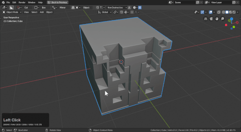

## Operations

# Operations Overview

After mode and shape is operations.

These have hotkeys that can be triggered during draw for rapid modification on the fly.

The first 4 operations are not the focus but they are:

- default (does nothing / this is the default state)
- draw (comes up during the draw operation)
- extrude (comes up during the draw to extrude operation) (hotkey: E)
- offset (triggers with O or E >> E during draw) (hotkey: O)

The 4 main operators are as follows:

- array (creates instances of mesh using array modifier) (hotkey: V)
- solidify (allows solidification for panel cuts using solidify modifier) (hotkey: T)
- bevel (bevels the shape has the ability to bevel edges and perform quad bevels) (hotkey: B)
- mirror (mirrors the mesh across the active shape using the origin and rotation) (hotkeys: 1,2,3)

___

# Array (in-mode hotkey: V)

During the draw mode or while paused:

V will trigger array. Pressing V a 2nd time will remove the array during draw.

During array the following hotkeys apply:

- x / changes axis to X
- y / changes axis to Y
- z / changes axis to Z
- V / adds or remove array

During this mode users can press ctrl + D for the mini helper for fine adjustment.

# Solidify (in-mode: hotkey: T)

During the draw mode or while paused:

T will add solidify to the shape. Pressing T a 2nd time will remove the solidification during draw.

During array the following hotkeys apply:

- 1 / changes offset to -1
- 2 / changes offset to 0
- 3 / changes offset to 1
- T / adds or removes solidify

During this mode users can press ctrl + D for the mini helper for fine adjustment.

# Bevel (in-mode hotkey: B)

During the draw mode or while paused:

B will add bevel. Pressing B a 2nd time will remove the bevel during draw.

Q will add a contour bevel to the shape resulted in an interior rounding on the shape.

During bevel the following hotkeys apply:

- Q / adds a countour bevel
- B / removes bevel

During this mode users can press ctrl + D for the mini helper for fine adjustment.

> During draw Q will also trigger bevel with a 2nd Q triggering contour.

# Mirror (in-mode hotkeys: 1, 2, 3)

1, 2, 3, during draw will add a mirror on the x/y and z axis. Pressing 1,2,or 3 and time will flip the axis and a 3rd press will remove the modifier.

> Because of bisect flip the mirror can be more confusing than I'd like. Knowing the axis you are on and dealing with goes a long ways in getting the most out of mirror.

During mirror the following hotkeys apply:

- 1, 2, or 3 - flips mirror
- 1, 2, or 3 (second time) - removes mirror.

During this mode users can press ctrl + D for the mini helper for fine adjustment.

> Notice that after mirroring the mirror operation remembered what was mirrored before and acts on it. This can be both a blessing and a curse.

To showcase it being problematic in action:

> When I try drawing from the other side it can have issues showing until I cross the main mirror point. This is something worth being aware of when working.
