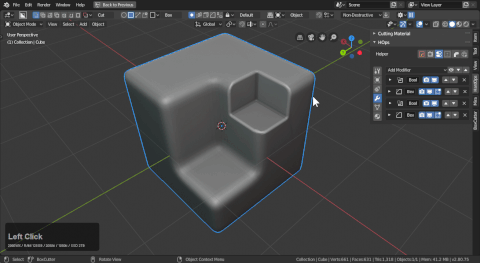
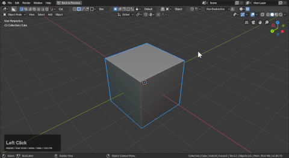
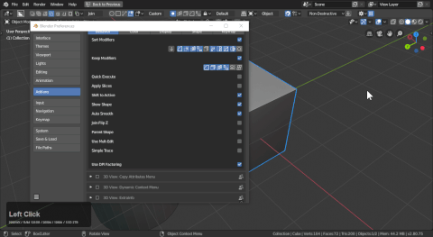
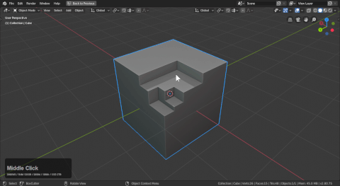
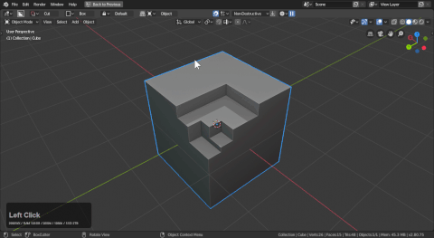

## Preferences

# Enabling Boxcutter

After enabling boxcutter there are a series of preferences. The main ones of imporance are accessible via the D menu and the topbar in the 3d view. Like sorting and the behavioral properties.

With boxcutter enabled you are ready to begin.

## Behaviors

# Sort Modifiers

The sort is used in conjunction with modifiers and keeping them in a particular area in the stack.

- Bevel / bevel sort was added to keep the bevel modifier at the top of the stack. Care was also taken to ensure this ignores vertex groups bevel mods and respects weight modifiers as well. This is used heavily in the angle workflow.

- Next to bevel sort is this arrow which means "latest bevel sort" this will only sort the highest level of the bevel. This allows for multi level stepping.

Below is the latest bevel sort in action.

- Weighted normal is a modifier for improving shading. And this should be kept at the end of the stack for that reason. Having it anywhere else will cause issues.

- Array is sorted to be kept after booleans. This allows you to cut arrayed objects and the effects propegate.

- Mirror with 2.8 has been changed to support bisect and as a result users can work on one side with effects taking place on the other. This makes it easier than having to do a cut then mirror it across the object however we have systems for that as well.

With multiple mirrors in the stack there can be issues but we do hope to improve upon this in the future.

- Solidify sort will keep the solidify before the booleans allowing you to cut on bevel modifier surfaces while keeping the mod stack live.

Notice the placement in the stack in the below gif.

- Simple deform will ensure boxcutter is able to cut objects using twist, taper or bend.

The placement differs based on whether it is enabled or not.

- Triangulate can be useful for having an exportable mesh kept live in the viewport. With this checkbox enabled  triangulate will be kept on top of the model.

- Decimate plays a variety of roles and because of that this should be kept off unless there is a case where you want this at the end of the stack.

In the below example you can see decimate being kept at the end of the stack.

- Remesh can be used to get a blocky minecraft effect and by sorting it that can be maintained.

In a way this can be used for an all quad mode.

- Subsurf will sort to be before any boolean modifiers. It is rare that any cases come up where this is needed.

___

# Keep modifiers

Keep mods keeps the selected modifiers live on a shape utilizing them.

The options in blue should remain off by default. Spin should only be on for non-destructive circles.

To show what it is like not keeping modifiers:

- bevel, solidify, array, mirror are on by default (this ensures being able to tweak afterwards)
- spin is applied so the center convergence can be dissolved resulting in a nicer circle
- lattice is never on. We turn this on for advanced diagnosis. Lattices are used by bc for placement so there is no need to keep lattices.
- you cannot reverse bevel an edge. Since the normals of an edge cannot be flipped.

> Only by applying spin can you use a boxcutter circle for reverse bevel in Hard Ops.

This video goes over the introduction of reverse bevel.

<iframe width="560" height="315" src="https://www.youtube.com/embed/6TdRQc1Grws" frameborder="0" allowfullscreen></iframe>

___

# Quick Execute

Quick execute will allow you to draw and it will automatically cut through the model. This can come in handy for quick cutting without the extrude phase.

# Apply Slices

Apply slices will apply the boolean operation completed by slice on the new object. This can be useful for simplification and preventing tabbing into a full shape when modifying.

> This can have issues with multiple slicings so we may need to adjust that behavior in the future.

# Shift to Active

When drawing a shape and shifting to live the selection is important. This option will toggle the active selection to the new object cutter instead of the main and sub object.

# Show Shape

This option will make shapes drawn stay behind for tweaking. This can also be toggled during draw with L. When pressed the shape will change slightly in appearance.

# Auto Smooth (on by default)

This will set smooth on the main shape prior to cut ensuring a nice result and good shading.

# Join Flip Shape Z

Sometimes join shapes will draw upside down which can be a nuisance. Pressing shift + F during draw can fix this but for fixing it before the operation this property exists.

Here is an example with it off.

And with it on.

# Parent Shape

This will parent shapes to the main shape. Allowing for transformation in the 3d view.

# Use Multi-Edit (unavailable)

Muti edit is the process of cutting into multiple meshes at once. This is built in behavior now.

# Simple Trace (unavailable)

We'll be adding this when it's working once more.

# Use DPI factoring

Some viewport items like the ctrl + D helper can display incorrectly on retina displays. This option fixes that if issues occur. If the ctrl + D helper shows fine this doesn't need to be toggled.

## Colors

The color tab contains many preferences for adjusting your boxcutter experience. Mainly I come here to change the color of snap dots periodically.

## Display

# Wires Only / Thick Wire

Makes the wires thicker for drawing and pressing H or enabling Wires only.

# Wire Width / Size Multiplier

Adding thickness to the wire.

# Topbar

Contains many options for the display in boxcutter.

Here I will show the versatility of the topbar.

## Shape

# Offset

Distance the mesh drawn is from the surface.

# Lazercut limit

Determines size for lazercut to be triggered.

# Circle Vertices

Segments used on circle. Can also be changed in the tool and on the fly.

# Array Count

Count on array modifier. Can also be changed in the tool and on the fly.

# Solidify thickness

Thickness on the solidify modifier. Can also be changed in the tool and on the fly.

# Bevel Width / Segments

Sets width / segments for bevel on cutter. Can also be changed in the tool and on the fly.

# Quad Bevel

Allows for double bevel on cutters resulting in an all quad bevel.

# Straight Corner Flow

Allows for quad bevel to flow straight on angular surfaces like ngon.

## Keymap

Keymap is by default optimized for vanilla out the box Blender. For users using alternative keymaps these settings exist. In the event of selection and navigational issues these setting exist to optimize your experience.

# Activate BoxCutter

Alt + W is the hotkey of boxcutter and can be useful for starting it and getting the topbar to show.

# Allow selection

Preserves left click for selection.

# Enable Surface toggle

This makes alt + W toggle the grid for orientation as well as toggling between boxcutter and hopstool.

# Disable Ctrl & Shift LMB Edit mode

With boxcutter in edit mode there can be issues with selection and in the even this happens you can use this option to disable ctrl as the activator for boxcutter in edit mode.

In edit mode you can accidentally cut while trying to select a loop. This can be annoying since path select is essential. It comes with the territory of using lmb as a default now.

# RMB Cancel Ngon

This option allows for right click to backstroke on ngon versus cancelling and starting over.

# Alt Center

This allows box to draw from center when alt is held.

# Shift Uniform

This allows shift to keep the shape uniform.

# Scroll Adjust circle

Enabling this allows scroll to adjust circle on the fly. I keep this disabled by default.
I find it easier to adjust segments via the ctrl + D helper.

