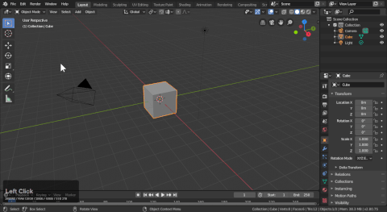
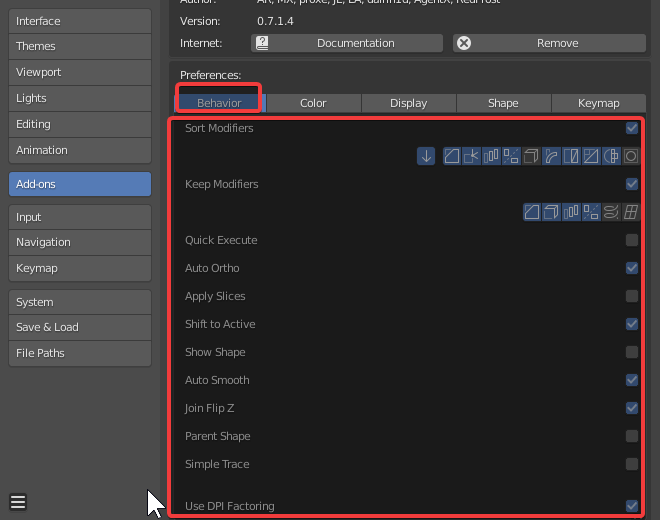
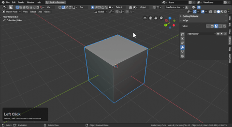
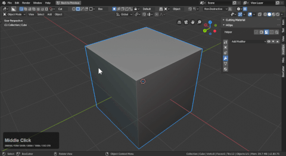

## Preferences

# Enabling Boxcutter

After enabling boxcutter there are a series of preferences. The main ones of imporance are accessible via the D menu and the topbar in the 3d view. Like sorting and the behavioral properties.

With boxcutter enabled you are ready to begin.

## Preferences In Depth

# Sort Modifiers

The sort is used in conjunction with modifiers and keeping them in a particular area in the stack.

- Bevel / bevel sort was added to keep the bevel modifier at the top of the stack. Care was also taken to ensure this ignores vertex groups bevel mods and respects weight modifiers as well. This is used heavily in the angle workflow.

Next to bevel sort is this arrow which means "latest bevel sort" this will only sort the highest level of the bevel. This allows for multi level stepping.

Below is the latest bevel sort in action.

- Weighted normal is a modifier for improving shading. And this should be kept at the end of the stack for that reason. Having it anywhere else will cause issues.

- Array is sorted to be kept after booleans. This allows you to cut arrayed objects and the effects propegate.

- Mirror with 2.8 has been changed to support bisect and as a result users can work on one side with effects taking place on the other. This makes it easier than having to do a cut then mirror it across the object however we have systems for that as well.

With multiple mirrors in the stack there can be issues but we do hope to improve upon this in the future.

- Solidify sort will keep the solidify before the booleans allowing you to cut on bevel modifier surfaces while keeping the mod stack live.

Notice the placement in the stack in the below gif.

- Simple deform will ensure boxcutter is able to cut objects using twist, taper or bend.

The placement differs based on whether it is enabled or not.

- Triangulate can be useful for having an exportable mesh kept live in the viewport. With this checkbox enabled  triangulate will be kept on top of the model.

- Decimate plays a variety of roles and because of that this should be kept off unless there is a case where you want this at the end of the stack.

In the below example you can see decimate being kept at the end of the stack.

- Remesh can be used to get a blocky minecraft effect and by sorting it that can be maintained.

In a way this can be used for an all quad mode.

- Subsurf will sort to be before any boolean modifiers. It is rare that any cases come up where this is needed.

___

# Quick Execute
