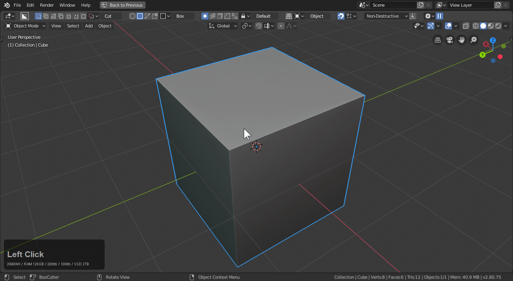
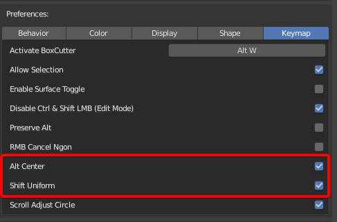
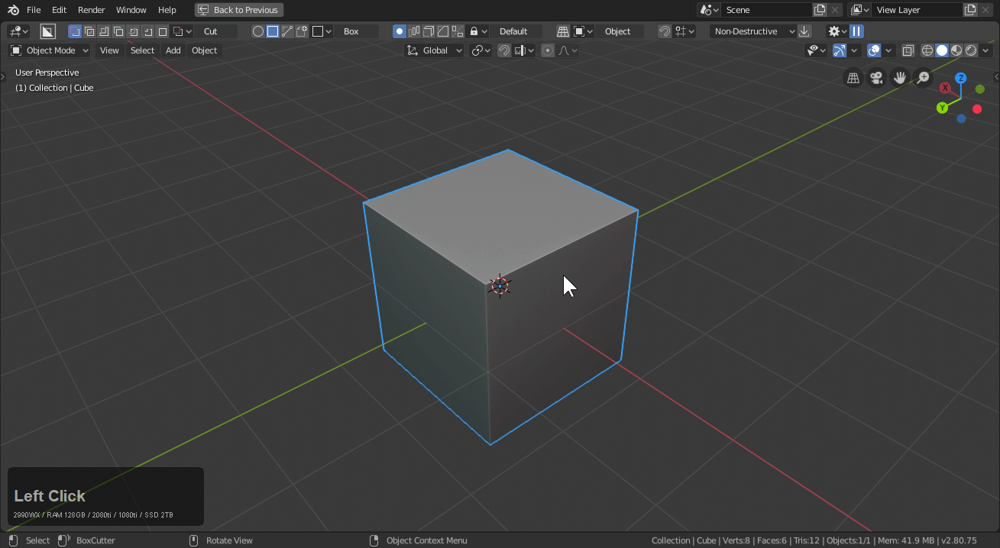
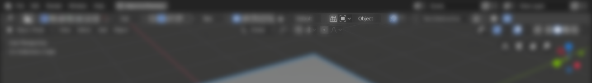
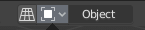
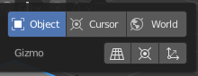
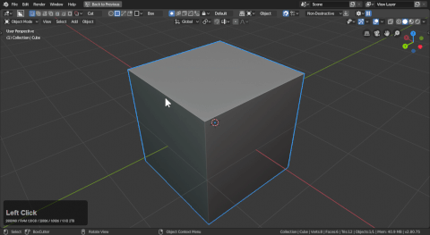
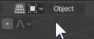
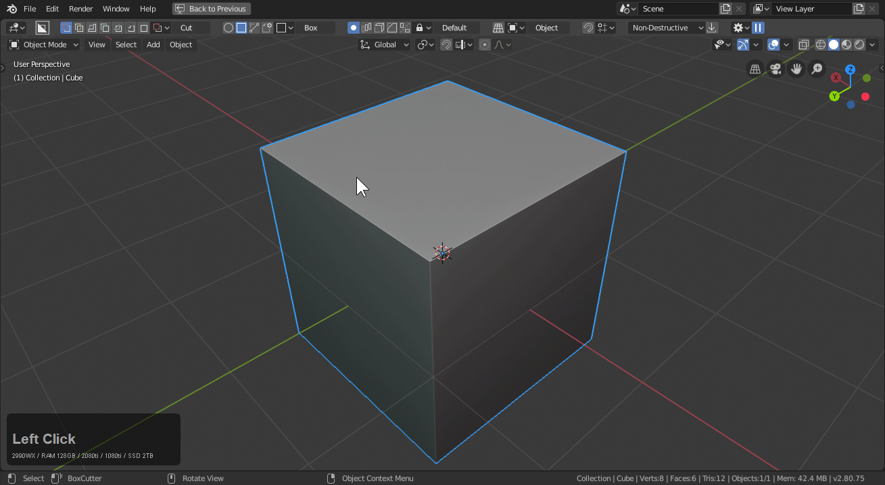
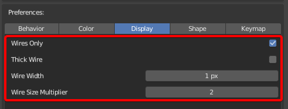

# Shape: Box

I used to say box was all I needed. I have a fondness for the box but let's keep it formal.

Box does just what the name entails. It draws a box. Corner draw by default.

First is the draw. and then the extrude. Click and let go and click to apply.

> You can draw and extrude or you can draw click and just lazorcut through the model.

# Center, Corner and Uniform Draw

For this to work the following prefs must be enabled. They are on by default and should only be off if your keymap is so odd that it is unable to be explained.

During draw the following draw modifiers apply:

- alt for uniform draw
- shift for center draw (where the box is the same on all sides)
- alt + shift for center uniform draw (how the cube center was cut)

Here you can see them in action.

# Modes

- [cut](mode_red.md)
- [slice](mode_yellow.md)
- [join](mode_green.md)
- [knife](mode_blue.md)
- [make](mode_grey.md)
- [extract](mode_black.md)

> Since extractions changes over to simple shape thats why the gif ended with custom shapes.

# Box Operations

Box can be started with any of the Operations:

- array
- solidify
- bevel
- mirror

To show them all in action:

# Repeat

Ctrl + double clicking will repeat the last operation.

You can repeat a variety of things even custom shapes.

Repeat can also be used with shift to live in order to adjust the repeated shape post operation.

> with shift to active not on the repeat to live selected the main object as well which is more clicking to deselect.

# Orientation

When an object is selected the default orientation should be object.

> The alternative is world and cursor.

# What is lazorcut?

Lazorcut is cutting without an extrude. It can either be done manually or with quick execute from the behavior panel.

> Quick Execute should definetely not be on by default.

# View Aligned cutting

This topbar button toggles view align cutting.

When it is on the box is draw from the view and not from the surface / cursor / world.

> View align is a throwback to our classic 2.7x beginnings.

# View align snap dot gotcha

When view align is on and you aren't aware the snapping dots on ctrl will behave differently.

This can be annoying until you realize view align up top is active. Just something to be aware of.

# Edit Mode Box

While being typically used in object mode. Box can also be used in edit mode with most of the shapes.

> In edit mode you may have to start boxcutter with alt + W or use the T panel icon

A few additional notes:

- users can even draw destructively in edit mode then shift to live to modify the shape in object mode.
- most of the shapes work but some are still in a state of repair but red box works
- edit mode boxcutter usually starts you in blue box so you can cut linework

# Wire Draw Type

During draw you can press H to show wire. This can come in handy if you need the absence of color for a moment. Or forever.

These are the preferences for setting the default for this behavior and the thickness of the lines.

