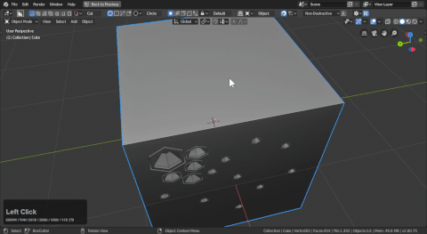

# Shape: Circle

Circle can be used with all the cut types and defaults from a center draw typically.

> In the above gif I started with box to show the corner draw then drew some circles then switched back to box to show how box can also be used with center draw to draw like circle.

# Circles and snapping

The snap dots can be powerful with circle to make subsequent cuts. These cuts can then be extracted and reused exponentially. [In fact any extraction is prime for reuse in kitops pro.](https://gumroad.com/l/kitops)

Snapping dots can be powerful with the circle since the center point is a nice face snap point.

# Extracting Using circles

Using two of my favorite features:

- active only (boxcutter only affects active object)
- face snap dots w/ secondary object thanks to active only. (it allows me an origin where there is none)
- extraction (take the entire area and make it a custom cutter)

And hardOps object scroll to bring back the shape.

Compared to the top the bottom was trivial.

> Active only is useless most of the time but having it as a jumping off point has changed my workflow.

# Circle bevel

Circles works with all the modifiers but I enjoy using it with bevel and extraction.

The ctrl + D helper will show segments for circle and bevel parameters if active.

To try and show that with an extraction and show some nuances.

A few things to note:

- sometimes undo will clear the custom cutter and put the logo in its stead. (better than a crash)
- going to the layer where this happens and selecting the extraction and pressing c will re-grab it

# Circle Hex

Circle can be used to draw hex patterns. With solidify to start then a follow up face snapped cut you can begin to detail an area quickly. Then of course extract and repeat.

- pressing ctrl + D brings up the boxcutter helper which can adjust circles on the fly
- the ctrl + D mini helper also displays modifier properties when present

# Scroll segments

If this option is enabled in preferences you have the ability to scroll segments in the circle during the extrude process.

> I keep this off by default. I don't like non-cylindrical numbers.

Users can also pause the shape and scroll segments as well.

# Circle and keep mods

We take care to dissolve the corner points on circles. However if you choose keep screw the constuction of the shape will remain visible. This could be useful for tweaking.

Keeps mods dictates what mods are applied on cutters.

- circle uses the spin mod so by keeping it the center vertex returns
- so does the editability
- also could possibly cause normal issues. Spin mods will flip normals on a dime.

I put a decimate on it at the end to make it easier to look at.

# Circle edit mode

Circles are also able to be used in edit mode like box, ngon, and custom.

> You may have to press alt + W to start.
