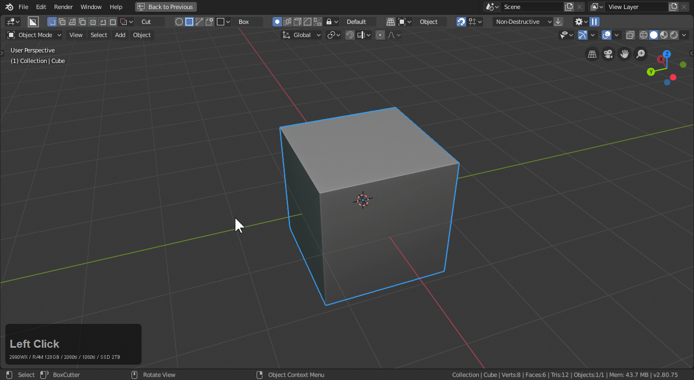

# Shape : Custom

Custom cutter is one of the more experimental shapes in boxcutter but it is useful for quite a few things and can result in a good time nonetheless.

> When nothing is selected as the custom cutter it draw's our logo. A nice way brand something.

Below is a video on making a custom cutter.

<iframe width="560" height="315" src="https://www.youtube.com/embed/k60evWExwVQ" frameborder="0" allowfullscreen></iframe>

# Self.Cut

Custom cutter is unique in that it can use itself as the cutter. This can result in some interesting results and the basis for many experimentations.

To show this in action.

This results in something I don't think I ever could have created just going to [boxcity](https://www.youtube.com/watch?v=Y-TsPNlBfIc&feature=youtu.be) on my own.

This can be extracted with something like circle to get some interesting results as well.

- modifier toggle was used to get a good snapping point for the extraction
- then the main object was hidden and a cylinder was able to be tested with

# hardOps Slice w/ self.cut

It is also worth trying out using hardOps slice in the Q menu with a self.cut cube.

And experiment even more.

# Using Custom with extraction

If extraction is used the mesh taken becomes the custom cutter. If nothing is taken the either a box or a logo will be present. To show that in action.

As of now extraction is the only mode that cycles into a different shape.

# C - Set Custom shape

Pressing C while in Boxcutter >> Custom shape >> allows you to set that shape as the custom cutter.

# 2d Grid Box Custom Cutter

2d grids can be used as custom cutters.

When I say grid I mean grid or subdividied plane with no faces.

Now in edit mode I will use that as the custom cutter.

> It's important to have only edges / Faces must be deleted.
> I admit the transition to edit mode is a little rough we'll improve it down the road.

# Custom Shape Scrolling

Users are able to scroll through collected cutters by either:

- C (pressing C during draw box/circle)
- alt + scroll during draw of box / circle / custom shape

In order to scroll custom shapes there must first be cutters to scroll through.

Now that we have some cutters in the collection that are not cubes we can scroll through them.

