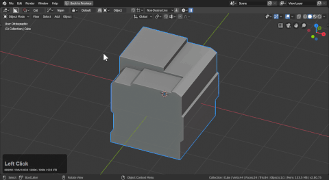
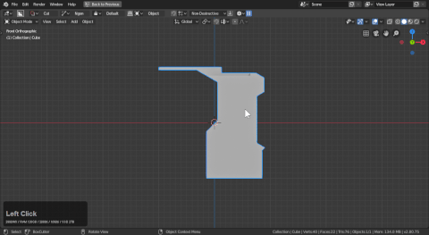
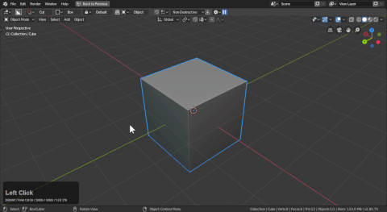

## Shape : Ngon

# Introduction

Ngon is a tool for the purpose of drawing custom shapes. [This isn't to be confused with custom shape which is another shape.](custom.md) Ngon is capable of snapping to angles and has a preset panel in the helper when selected as the draw type. Ngon is capable of working with all modes and draw types.

# Ngon Basics

Click and drag to start then click to add points.

Double click on the final point to end drag and extrude.

To show ngon in action:

A few details about ngon.

- ctrl will allow free movement while default is set to snap to the angle parameter set
- pressing H during draw will cycle over to wire mode
- double clicking on the final point will allow users to extrude
- triple click will lazorcut and end the operation (useful for quick cuts)
- backspace will undo a point
- right click will cancel operation

# Backspace points

Pressing backspace will allow users to go back one point and redraw in the event a mistake was made.

# Ngon Lazorcut

In the event you want to cut into infinity: triple click the final point to end operation, skip extrude and cut completely through the model.

> Quick execute normally ends the operation sooner but it's not working from side view.

# Cursor Alignment w/ Ngon

[For more on cursor alignment see alignment.](alignment.md)

By using the [3d cursor alignment gizmo](alignment.md): users will be able to draw on a surface offset by using the 3d cursor for orientation. This can come in handy for beginning your drawing off of the mesh.

- sometimes the cursor alignment will cause and offset issue on the cut. Users can press (e) to adjust offset.
- with default configuration of blender shift + rmb places the cursor.
- with the enable surface toggle check users can toggle this state with alt + W while boxcutter is active.

# Ngon Cyclic

Pressing C during draw will cycle cyclic mode. We intend to make this into a dedicated tool down the road but for now it is a feature of ngon.

> Cyclic is intended to be used with T for solidification before apply. Otherwise it has a 30% chance of doing a bisect.

To showcase ngon cyclic in action:

- after double clicking the final point to apply you can press:
  - T for Solidify
  - B for Bevel
- this mode is intended to be used with solidify as the starting operation

> Notice how solidify remembers the last amount it was left at for subsequent cuts but working this way eliminates multiple keystrokes.

# Blue Knife w/ Ngon Cyclic

As explained previousy: when using ngon c will cycle cyclic. If you use this with knife you can cut lines into models and with wireframes showing you can efficiently clean up booleans.

> Having lines that don't converge with corners will result in smoother shading and a better result with the bevel modifier.

## Ngon Operations

Ngon is compatible with all of the operations in boxcutter.

- [Bevel](operations.md)
- [Array](operations.md)
- [Mirror](operations.md)
- [Solidify](operations.md)

Here you can see each of them in action.

a few things to note:

- bevel won't show segments live until the extrude process. In the event of reset press B to bevel
- solidify is drawn with double thickness to make it more obvious
- array works off the bat and is live
- mirror can make the mesh not draw if shown on the wrong axis. I had to press 1 to set x mirror to -X in order to draw. This may be improved in the future.
