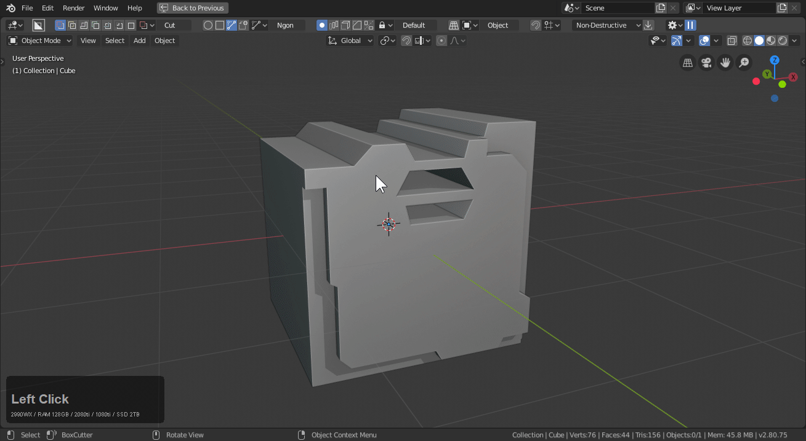
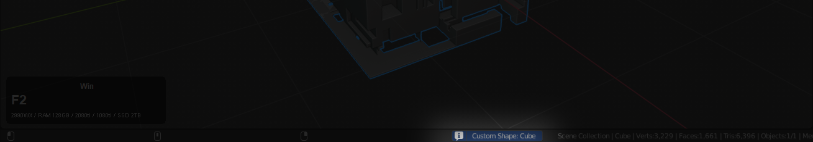

## Shapes

# [Box](shape_box.md)

[Box has it's own page going into depth. More information here.](shape_box)

Box is the primary shape of boxcutter and is my goto for cutting and basic shapes. This shape is also compatible with all modes.

[This page has all you need to know about box.](shape_box)

# [Circle](shape_circle.md)

[Circle has it's own extensive page going over this tool in depth.](shape_circle.md)

Circle is capable of going from a simple tri, to a octagon, hexagon and finally circle. During draw using the ctrl + D is useful for adjusting parameters on the fly.This shape is also compatible with all modes.

# [Ngon](shape_ngon.md)

[Ngon is the shape for drawing custom shapes and has a page going over it in depth.](shape_ngon.md)

Ngon can be angle snapped while holding ctrl which can make angular drawing easier. This shape is also compatible with all modes. Ngon is confirmed by double clicking the final point. You can also backspace with backspace.

Ngon also has a cyclic mode which can be used in conjuction with solidify to do panel cuts with ease.

> While in Ngon toggle cyclic with C
> Best used with solidify either as a start operation or pressing T after the first confirmation click.

# [Custom](shape_custom.md)

[Custom is a special cutter than can be either the mesh itself or another mesh in the scene. There is also an extensive page about it here.](shape_custom.md)

Users can set self.cut by choosing custom shape and then pressing C with the main object selected.

> After pressing C the name will show in the info area below.

You can also use any shape as the custom cutter.

