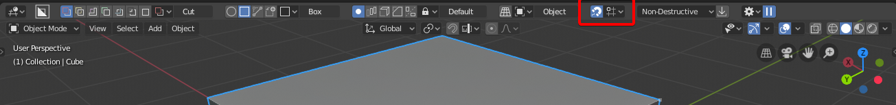
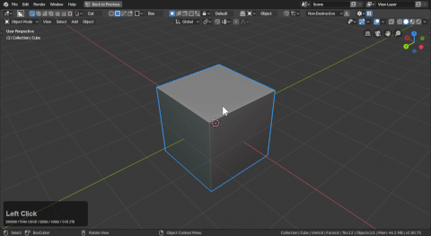

## BoxSnap

# Intro to snapping

Snapping can be started from the top bar using the magnet icon.

It is also present in the d-pie with the snap options.

Snapping has a series of options.

Holding ctrl with boxcutter active will cause dots to show up for start position when drawing. We'll get to increment snap later.

# Adjusting snap dots to perfection

Depending on monitor you may need the dots bigger or just more colorful. Lets get into the prefs.

In the prefs I adjusted the dots using the dot size and fade distance.

> Fade distance can be a nice visual relief from seeing too many dots.

> A red highlight will make these dots show up better in the future.

# Face snapping

Face snapping works well for getting in the center of an are however face alone can be lonely and provide less options than desired.

# Edge snapping

Currently edge snapping works with the midpoints of edges however we do intend to extend this in the future.

# Vert Snapping

Last but certainly not least is vert snapping. This one gets the least amount of talk but is still an essential option to have.

# Increment Snapping

Increment snap is the only snap that can affect extrude as well.

When increment snap is enabled additional options will appear.

- the icon on the left turns increment snap on and off
- the number is the amount in BU to snap to (default requires ctrl for snap)
- turns on increment snap by default (removes need to hold ctrl)

To demonstrate it in action.

# Using unapplied faces with face snapping for extractions

Sometimes a shape heavily modifier from booleans would be snapped from were it earlier in its history. Like the beginning. This is a workflow I use to extract things that normally would be difficult to take or at least require adjustment and fine tuning.

# Snap is perfect for circles

When it comes to getting circles in the right place snapping is your friend.

