## Troubleshooting

Issues are bound to occur when using Booleans and concept modelling workflows. There are support tools across hardOps and boxCutter for making the process easier.

[When it comes to reporting issues there are ways to best convey to us what is going on as well.  ](https://hardops-manual.readthedocs.io/en/latest/issues/#helping-us-help-you)

# Why is this cutting weird?

When it comes to troubleshooting cutting the first thing you want to check is orientation. Notice how different world and surface can behave when it comes to affecting draw.

> World is intended to be used as a fallback in the event a surface isn't present for draw. We believe that starting out drawing without a selection can trigger the orientation to be in this mode so awareness is key for being on top of orientation.

# After reading the manual I still have problems with cutting. Can take a look of this behavior?

Q: Step1. Mode CUT, Shape SQUARE. Draw a small square...

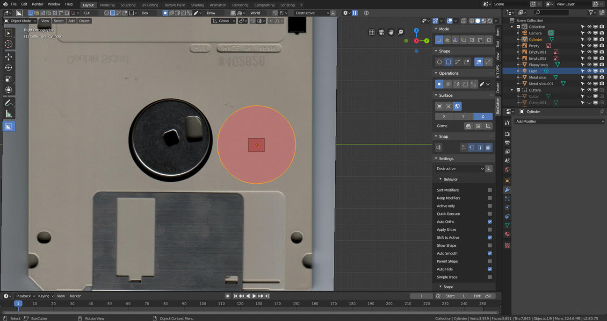

and then I get this:

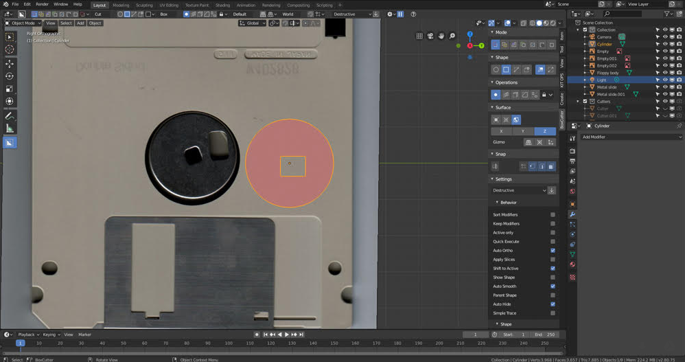

This problem drives me crazy. I have this odd behavior since day one. Sometimes instead of a square I get a circle cut. On my PC the program acts randomly. Like if I try to do one cut the program could do 3 different thing while the cut function is on.

A: If you release alt before LMB the center draw will revert on box draw (Default)
**Applying scale is crucial. If the scale is unapplied things like lazorcut will not work properly.**
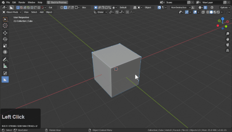

>Alt **during draw** triggers center draw
>shift **during draw** triggers box draw

Alternatively there is also center draw which removes the need for alt. During tab to edit hotkeys to modify during draw dot also remain present and available.

Extended Response:

When it comes to shapes, [this page covers shapes](https://boxcutter-manual.readthedocs.io/en/latest/shapes/)

Boxcutter has [box](shape_box.md), [circle](shape_circle.md), [ngon](shape_ngon.md), and [custom](shape_custom.md) as [shapes so technically it could do multiple types of shapes](shapes.md) if the [topbar isn't being payed attention](interface.md) to.

The topbar will tell you what shape is in use.

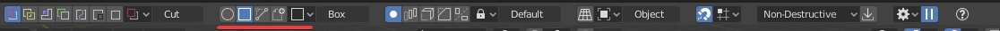

As long as it says box its a box. However sometimes if the shape is "too" small it can trigger something called repeat which is the last shape made. [Lowering the limit](https://boxcutter-manual.readthedocs.io/en/latest/preference/#lazercut-limit) can be capable of fixing it as well.

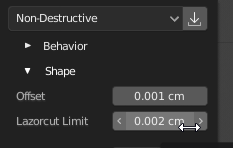

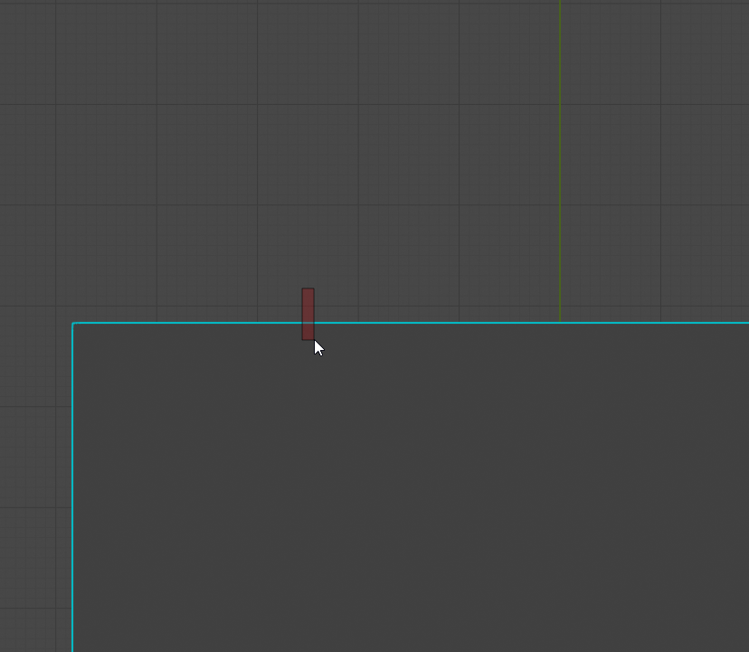

> Above image is the lazorcut issue that can be triggered when drawing too small.

I have never heard a report of it cutting a shape that was not intended but id have to see it in action. When we [can see what is causing grief it makes it much easier for us to analyze](https://hardops-manual.readthedocs.io/en/latest/issues/#helping-us-help-you) it.

Using the current version I took a crack at making the shape. To break down the process.

> I added a cylinder and rotated it sideways and applied scale with ctrl + a >> scale before the gif.

- using drew a box and used shift to live to adjust the shape and modify it in edit mode.
- for the second shape I used [hops >> q >> operations >> modifier toggle](https://hardops-manual.readthedocs.io/en/latest/operations/#modifier-toggle) to turn off modifiers to get a good center dot and made the second cut.
[During draw pressing alt will do a center draw.](https://boxcutter-manual.readthedocs.io/en/latest/shape_box/)
- for the second cut I [tabbed to live](https://boxcutter-manual.readthedocs.io/en/latest/dots/) and used bevel instead of blender's edit mode
- using the bevel command added a bevel on top which required some edge cleanup with I used J in edit mode to [provide some guidance edges.](https://hardops-manual.readthedocs.io/en/latest/discussion_cylinoid/#fixing-boolean-flows-w-bevel)

When it comes to drawing using center. It can be set in the topbar here.

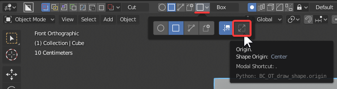

I don't normally change it there since it can be modified with the alt key during draw.
This is the normal box behavior. With corner draw.

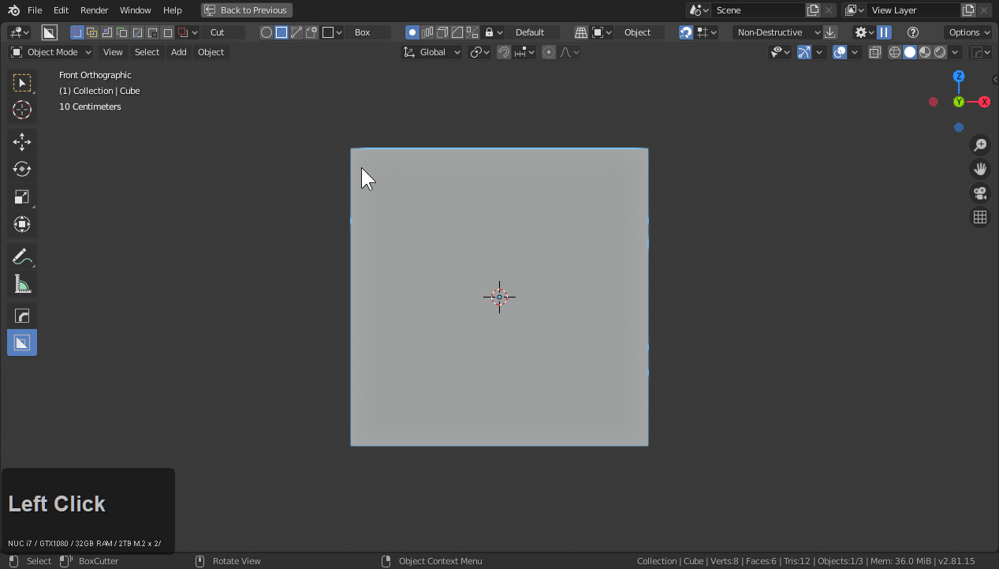

With alt being used during draw. Center is used.

Alt + Shift will make it constraint to center. Making a perfect center box draw.
While drawing with left mouse you can also pause with right mouse click and adjust the shape more finely from there.

# Why does my bevel look weird?

First, let's check face orientation.

Sometimes a shape can come in with the normals flipped. In 2.8 this can be harder to see. With the hardOps
alt + V submenu users can view the shading to find the red.

Notice how when the normals are flipped things behave as expected.

> shift + N in edit mode with everything selected flips normals

When the normals are all blue things will behave as expected.

Face orientation is located in the viewport area of the 3d view.
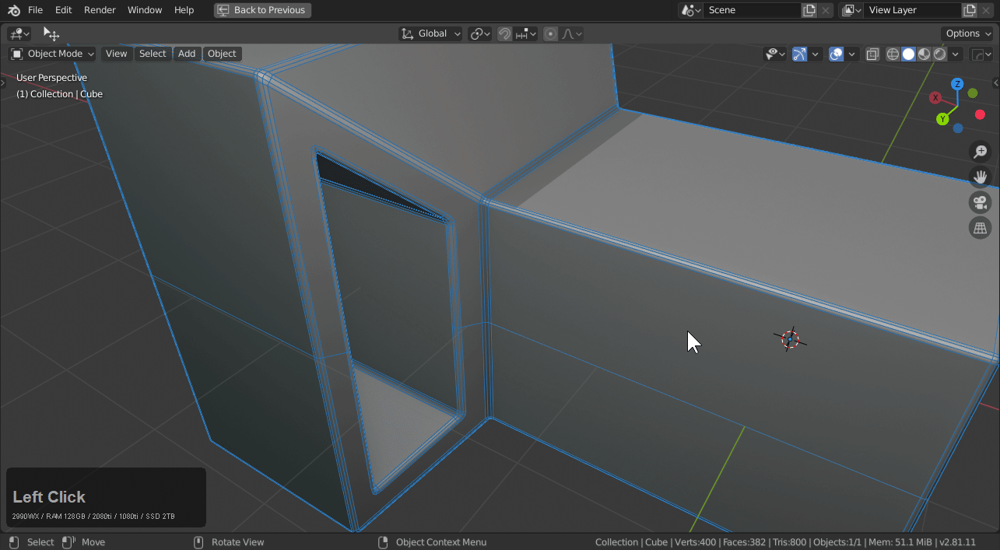

# Why did my extraction fail?

Extractions can be strict at this moment with the following rules:
- extract only takes live Booleans
- extract only works on meshes with applied rotation / scale / location

This is typically how extraction can behave.

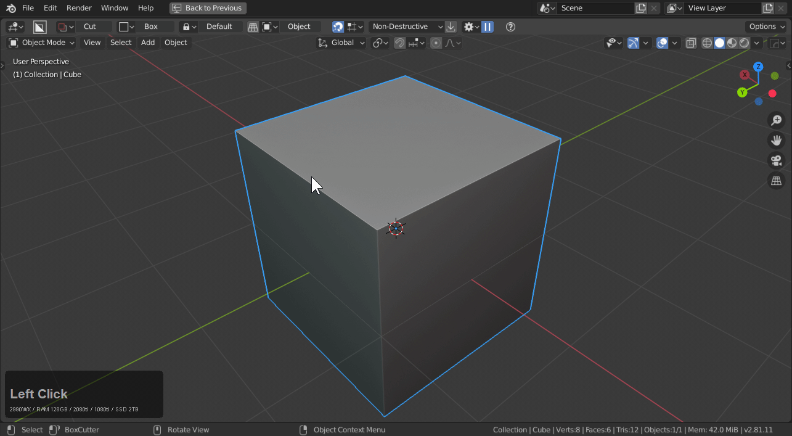

Notice how troublesome extractions get with unapplied rotation.

Once rotation is applied it behaves a little better.

# Why are my bevels skewed?

Depending on the geometry supplied bevels can show incorrectly.

Here we'll set up a few booleans and then bevel it.

By viewing the wires we can see what is going on.

[Blue box](mode_blue.md) is capable of fixing it. By adding an edge the bevel is able to better deal with the boolean.

# How would you fix this shape?

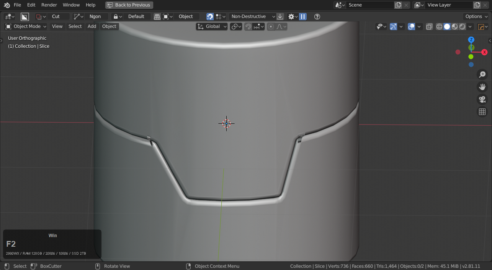

To first create the situation.

We could solve this by using:
- mirror (bisect) *this will need to be applied before using booleans again*
- bevel (3 segements / profile 1)
- isolation loops

And to fix the bottom.

Without the solving of the area to relax the bevel it shades differently. You can also cleanup to a minimal amount and get away with it but getting it right allows for close-ups and less visual artifacting.

It can require some finessing to get both the form and the bevel to be guided properly by the flow. However this isn't possible non-destructively at this time.
