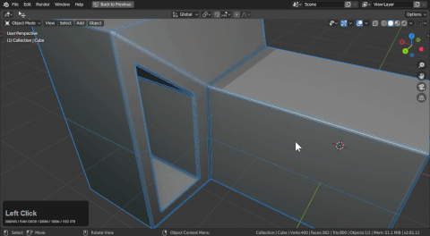
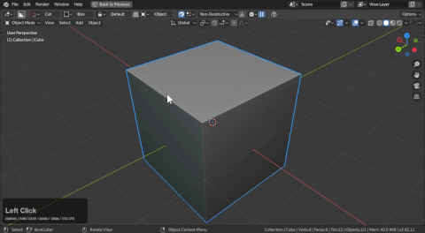

## Troubleshooting

Issues are bound to occur when using Booleans and concept modelling workflows. There are support tools across hardOps and boxCutter for making the process easier.

# Why does my bevel look weird?

First, let's check face orientation.

Sometimes a shape can come in with the normals flipped. In 2.8 this can be harder to see. With the hardOps
alt + V submenu users can view the shading to find the red.

Notice how when the normals are flipped things behave as expected.

> shift + N in edit mode with everything selected flips normals

When the normals are all blue things will behave as expected.

Face orientation is located in the viewport area of the 3d view.

# Why did my extraction fail?

Extractions can be strict at this moment with the following rules:
- extract only takes live Booleans
- extract only works on meshes with applied rotation / scale / location

This is typically how extraction can behave.

Notice how troublesome extractions get with unapplied rotation.

Once rotation is applied it behaves a little better.

# Why are my bevels skewed?

Depending on the geometry supplied bevels can show incorrectly.

Here we'll set up a few booleans and then bevel it.

By viewing the wires we can see what is going on.

[Blue box](mode_blue.md) is capable of fixing it. By adding an edge the bevel is able to better deal with the boolean.

# How would you fix this shape?

To first create the situation.

We could solve this by using:
- mirror
- bevel (3 segements / profile 1)
- isolation loops

And to fix the bottom.

Without the solving of the area to relax the bevel it shades differently. You can also cleanup to a minimal amount and get away with it but getting it right allows for close-ups and less visual artifacting.

It can require some finessing to get both the form and the bevel to be guided properly by the flow. However this isn't possible non-destructively at this time. 
