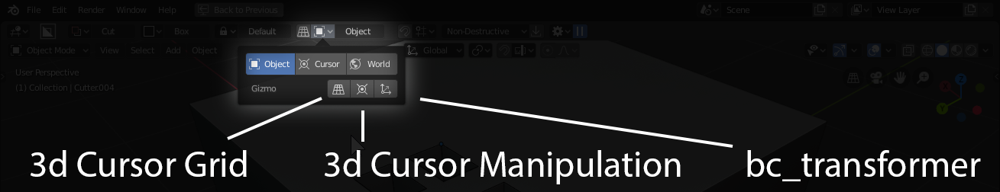
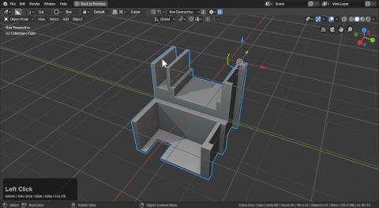
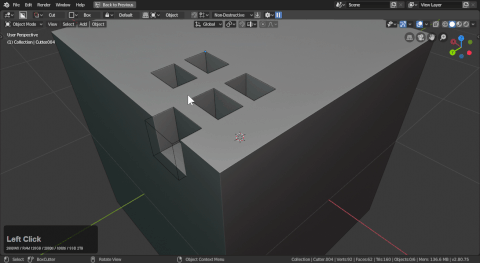

## Widgets

Over the course of boxcutter we experimented with some ideas for widgets that took care of simple needs like the cursor grid alignment system and the bc_transformer.

Below is a breakdown if the widgets area of the orientation subpanel of the topbar.

> Widgets and options are also in the N panel and D - Pie.

# Cursor Grid Alignment widget

[see alignment](alignment.md)

# BC_transformer

This is why this page exists. I somehow needed to talk about the bc_transformer.

For more information on what this does we can enable it and look at the tooltip.

> It is a work in progress and might be replaced / upgraded in future versions.

The bc_transformer can be used to clone objects with shift held on transform. The boolean operation will also be duplicated.

This also possesses scale and rotate options but they are rarely used.

> Notice that ctrl + shift clicking a transform reverts it to default value.

