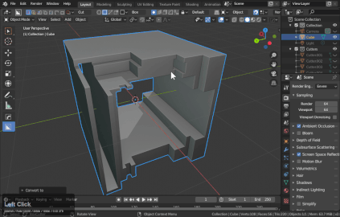
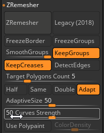

## Zbrush w/Boxcutter

<iframe width="560" height="315" src="https://www.youtube.com/embed/CgVtbl__ZGE" frameborder="0" allow="accelerometer; autoplay; encrypted-media; gyroscope; picture-in-picture" allowfullscreen></iframe>

- polish by groups
- polish by features
- mirror and weld

Using the hops exporter will ensure the result is triangulated and applied for zbrush.

 

 In zbrush grouping via normals and then creasing with the zremesher set to keep groups and crease.
 Curve strength can also help in more complex situations.

 

 
